# Private LAN planning and shared chat operations design

**Proposed, documentation only; reviewed 2026-10-08.** This is a target design,
not a claim that current Axel enforces isolation. No accounts, credentials, network
rules, integrations, inference services, printers, or deployments are provisioned.

## Privacy and security invariants

**These requirements govern every architecture, adapter, rollout, and test below.
The sensitive profile must fail closed if any required control cannot be enforced.**

| ID | Required boundary for the sensitive profile |
| --- | --- |
| I1: user-controlled LAN | Private inference uses only a dedicated user-controlled local-network token.place relay and explicitly enrolled, trusted LAN compute pool. The boundary is the user's isolated LAN, not one machine. No Internet egress, public relay, external provider, or public fallback from private processing, relay, or compute. |
| I2: device-local state | Captures, attachments, project index, task database, workdirs, kanban, and UI remain on the harness device. UI and approval endpoints are device-only, with no LAN ingress or forwarding. Only minimum task context transits to approved LAN compute; that does not grant corpus/filesystem/UI access. Prompts/results are transient there, with no content logging or persistent cache. |
| I3: enforced topology | Enforce destination/port restrictions and independently provisioned relay/compute identity and membership before releasing context. E2EE, localhost, private IPs, and relay-advertised keys do not prove topology or compute ownership. Unknown membership, unenforceable routing, stale trust policy, or model outage blocks inference; no silent downgrade. |
| I4: data is not authority | Bookmarks, messages, pages, papers, models, repository files, CI logs, and model outputs are untrusted data. They cannot grant tools, change policy, enroll nodes, execute code, approve exports, deploy, or print. Processing uses owner-approved fixed profiles and independently enforced permissions. |
| I5: separated network stages | Discord/Slack sync, public-link retrieval and GitHub reads run in constrained network-capable stages isolated from private processing. They cannot mount or query its corpus, database, workdirs or inference sessions. After sync, cached analysis/planning can work without Internet; live sync/retrieval cannot. |
| I6: exact outbound approval | Private corpus, prompts, derived summaries, task titles and relationship metadata are not automatically posted to chat, cloud agents, GitHub or artifact hosts. A trusted local UI must approve exact sanitized bytes, destination, audience and purpose for each outbound PR/artifact/message. Only that approved copy enters an isolated exporter. |
| I7: no hidden egress | Deny telemetry, remote logs, crash/error uploads, hosted tracing, analytics, remote UI assets, automatic model/dependency downloads, updates and public discovery during private processing. Credentials stay outside prompts/model-visible files; network-stage credentials are absent from private workers. Pre-provision verified models, tools and dependencies. |
| I8: no physical or production authority | A print queue is a capability-aware proposal, never autonomous printing or printer submission. Deployment/rollback stays with Sugarkube; the sensitive profile has no production authority. Analyze/draft approval is not publish, merge, deploy or actuate approval. |
| I9: durable fail-closed policy | Restarts, restores, retries, pauses and lost delivery preserve classifications, approvals, consumed execution/export keys and newest trust-policy state. Unknown state blocks dispatch/export. Working-hours rules and the owner's stop deadline apply before each mutation, including resumed work. |

token.place is offline-first federated inference software; public token.place is one
deployment, not the definition of the software. Arbitrary relay URLs, self-hosting
and federation remain globally supported. **This restricts one sensitive Axel
profile**, not token.place's general URL or federation capabilities. Inference may
span approved LAN nodes without public infrastructure. No private server identifiers,
messages or topology belong in this public design or its examples.

## Purpose and user workflows

Turn an opted-in bookmark backlog into local, evidence-linked plans and actionable
queues. Reuse core ingestion/event/task logic across Slack and Discord; separate
transports, private processing, inference and optional export adapters. The local UI
is the primary planning/approval surface. Chat is an optional source and approved
destination, not a default window onto the private corpus.

1. **AI paper/article to project work:** sync a selected generic bookmark and separately
   retrieve its approved public source. Cache bounded text/provenance. Offline analysis
   relates claims to a known local project's pinned snapshot, explains relevance and
   uncertainty, and proposes a design/remediation task. Its local kanban card includes
   evidence, acceptance criteria, dependencies, effort and owner. A separately granted
   local drafting task may create a patch in an isolated workdir. Publishing a sanitized
   design/remediation PR requires a distinct I6 approval; content or agents cannot approve it.
2. **3D model/technique to print planning:** cache an approved bookmark and inspect files
   with bounded non-executing parsers. Compare against the local printer, material,
   build-volume, nozzle and process capability catalog. Propose a print card with source
   and license metadata, scale, orientation/support assumptions, missing measurements
   and required human validation. Label estimates as estimates. Unsupported capabilities
   block readiness. Queue placement does not trigger slicing, G-code execution, printer
   upload or printing; physical operation remains a separate human action.

Both flows support deduplication, relationships between sources, relevance explanations
and human correction. Stable source IDs and content hashes supplement titles. Proposed
local board columns are inbox, triaged, planned, ready, blocked and done, independent
of execution state. Model output cannot establish verified completion without evidence
or a recorded human decision. Empty/stale project catalogs remain visibly empty/stale;
no silent online replacement fetch.

## Existing implementation and gaps

These source observations do **not** establish sensitive-profile readiness.

| Source | Current behavior and required change |
| --- | --- |
| [Discord guide](../discord-bot.md) and [bot](../../axel/discord_bot.py) | Mention capture includes context and downloaded attachments. Markdown encryption is optional; legacy captures and attachments can be plaintext. Search/summary/digest/quest replies use `ephemeral=True`, which still exports to Discord. Strict mode must disable those exports and automatic attachment retrieval until isolated import/export controls exist. |
| [Repository loader](../../axel/repo_manager.py) | Missing local repository files can auto-fetch GitHub data when credentials exist or fetching is requested. Use a pinned local catalog, disable auto-fetch and deny network independently, including against inherited environment overrides. |
| [token.place adapter](../../axel/token_place.py) and [quests](../../axel/quests.py) | Primarily model-metadata discovery, quest/template enrichment and administrative helpers including key rotation. A configurable URL/model listing is not a verified private inference dispatcher. No administrative helper belongs in a content-driven action profile. |
| [Local agent guide](../LOCAL_AGENT_PROMPT.md) | A local model URL/web UI alone does not disable provider integrations, package downloads, telemetry, assets or tool networking. Additional enforcement/evidence is required. |
| [token.place architecture](https://github.com/futuroptimist/token.place/blob/a42a58f824f21d5b4c51a22db838116899d49983/docs/ARCHITECTURE.md) | Compute sees plaintext; relay E2EE does not independently verify compute ownership. Its [verified-compute proposal](https://github.com/futuroptimist/token.place/blob/a42a58f824f21d5b4c51a22db838116899d49983/docs/design/verified-compute-trust.md) is proposed, not a shipped guarantee. No private prompt release without enforced membership independent of relay discovery. |
| [token.place configuration](https://github.com/futuroptimist/token.place/blob/a42a58f824f21d5b4c51a22db838116899d49983/README.md) | General deployments support alternate/fallback relay URLs. Reject external fallbacks on strict-profile client, relay and compute, and independently block escape. Preserve these general capabilities elsewhere. |

[Remote Claude Code control](remote-claude-code-control.md) remains a separate,
network-capable workflow outside this private profile. Dots public-channel reads and
mentions, and current-private-conversation-only reads, were reported in the initiating
session; automatic bot-post wake was unverified. These are session assumptions, not
a public API. Cloud/Dots handoffs are optional approved exports outside strict
processing, never default corpus access. Do not publish private tool protocols.

## Architecture and data flow

```mermaid
flowchart LR
    Chat[Approved Discord or Slack sources] --> Sync[Constrained online ingestion]
    Links[Approved public links and project snapshots] --> Sync
    Sync --> Quarantine[Bounded quarantine on harness device]
    Quarantine --> Import[Validated snapshot import]
    subgraph Private[Private processing: harness device and isolated trusted LAN]
        Import --> Corpus[Device-local corpus and project index]
        Corpus --> Core[Local planner, task ledger and kanban UI]
        Core --> Relay[Dedicated LAN relay]
        Relay --> Compute[Enrolled trusted LAN compute only]
        Compute --> Core
        Core --> Draft[Device-local plans, patches and print proposals]
        Draft --> Approval[Human reviews exact sanitized export locally]
    end
    Approval --> Packet[Approved immutable export packet only]
    Packet --> Exporter[Isolated online exporter]
    Exporter --> Dest[Approved PR, artifact or chat destination]
```

Import/export arrows are controlled data transfers, not routes out of private workers.
Use separate processes and OS-enforced network, filesystem and credential domains;
use stronger VM/device separation where necessary. No long-lived bot gets both corpus
access and Internet credentials. A trusted non-model transfer controller imports
snapshots and releases approved packets. No shared writable directory lets a network
stage replace policy, read private output or race an export. Exporter mounts only its
immutable packet, never the database, workdir, `.git`, home or model session.

**Ingestion (I4/I5):** authorize immutable tenant/channel IDs, opted-in items and bounded
context. Credentials are destination-bound and never forwarded to link targets.
Public-link retrieval is separately allowlisted: validate scheme, each redirect, DNS
result and resolved IPv4/IPv6 address; reject private/LAN, loopback, link-local/metadata,
file URLs and proxy escape in that fetcher. No scripts, macros, active HTML, external
image loads, archive execution or repository hooks. Bound size, recursion, content
types, time and decompression. Sandbox parsers; import inert text/metadata and quarantined
artifacts. Content suggesting another URL cannot authorize its retrieval.

**Private processing (I1-I4/I7):** corpus, embeddings/indexes, cached projects, board
and workdirs stay on the harness device. UI and approval endpoints bind only to
loopback or a device-local socket, with host-firewall denial of LAN ingress on both
IPv4 and IPv6. No reverse proxy, tunnel or port-forward exposes them remotely.
Process/network isolation also denies online ingestion/export stages access to these
endpoints, even on the same host. Retain authentication/CSRF protections and bundled
assets; no remote fonts, embeds, unfurls or analytics. This device-only UI restriction
does not restrict approved inference to one machine or make localhost proof of the
inference topology. Fixed planning/drafting tools have bounded filesystem permissions;
a harness's usual shell, browser, package manager, Git remote, printer API or arbitrary
HTTP capability is not automatically available. Local draft tests run in the same
offline sandbox with provisioned dependencies and no untrusted hooks.

**LAN inference (I1-I3/I7):** an owner-enrolled manifest binds relay identity, approved
addresses/ports, compute operator identities/keys, admitted nodes, model artifacts and
policy version. Provision trust independently of discovery; verify selected compute
before sending context and authenticate responses. Relay admission and client-side
compute verification are distinct controls. Relays cannot extend the manifest.
Revocation, key/membership changes and expired cached trust require owner review;
unknown freshness fails closed. Approved multi-node scheduling is allowed; open
federation and node self-enrollment are not allowed for this profile.

Default-deny egress applies to worker, relay and every compute node, with explicit
approved LAN tuples only; restrict ingress/admission too. Verify all active interfaces,
IPv4/IPv6, DNS, proxies, VPN/tunnels, containers and forwarding. A private subnet wildcard
is not destination identity. Disable inherited proxies and redirects on prompt or
credential-bearing calls; reject DNS rebinding and revalidate destinations. No
Internet-bound DNS/alternate transport may carry private data. Network stages cannot
serve as reachable proxies or inference fallbacks. Compute runs provisioned local
models, never an external API. Missing model/relay/compute blocks inference while cached
search/board work remains usable. Only an already approved, disclosed local alternate
model/node is permissible; no on-demand download.

Compute receives minimum context, not a corpus mount. Disable prompt/result persistence,
training capture, remote diagnostics and content-bearing swap/dumps/caches; verify any
necessary transient storage treatment before use. Apply equivalent relay diagnostic
controls. Compromised trusted devices remain a residual risk: identity/firewalls do
not prove correct inference or prevent a trusted operator retaining plaintext. If
controls cannot be enforced and demonstrated, report
`blocked: private_profile_unverified`, not a current isolation guarantee.

**Export (I6/I9):** human review covers the sanitized copy's diff, filenames, commit/PR
text, citations, attachments, destination and audience. Remove private IDs/messages,
personal notes, unrelated context, hidden metadata, credentials and unintended project
relationships. Automated redaction assists but cannot approve. Bind approval to packet
hash, destination, audience, purpose, expiry and task version; seal bytes and recheck
before transfer/send. Any change needs reapproval. Declassification applies only to
that copy, not the corpus or later summaries. Exporter cannot request more private
context; receipts return as validated status data. Even a denial/status notice or task
title can leak private work: send nothing unapproved, including ephemeral chat replies.

## Shared contracts and local state

Schemas are proposed, versioned, size-bounded and validated. Every record carries
`profile_id`, classification and policy version. Unknown major versions fail closed;
additive metadata cannot alter authorization. URLs/excerpts are data, not executable
locators. Private provenance/relationships remain local.

| Record | Required meaning |
| --- | --- |
| `Source v1` | Source/item ID, immutable tenant/channel/thread/message provenance where applicable, locally stored retrieval URL, content digest, cache version/time, source audience, parser status and retention policy. Each embedded context item needs provenance. |
| `Event v1` | `event_id`, `source`, `source_event_id`, `kind`, UTC observed/source times, `subject_id`, ordered `revision`, `status`, correlation/causation IDs, local evidence and audience policy; optional repo/app ID and explicit environment (`none`, `staging`, `prod`). |
| `Task v1` | ID/version, source/evidence IDs, requester/owner, local project snapshot, intent/fixed action profile, input digest, required capabilities, harness, execution state, board column, deadline. No arbitrary shell, host, path or environment bag. |
| `Approval v1` | ID, task/version/input digest, principal, exact action/scope/environment, issue/expiry times, nonce, policy version, revocation and durable consumption state. Export additionally binds exact packet digest/destination/audience/purpose. Processing approval never authorizes export. |
| `Delivery v1` | Approved packet ID/hash, destination, delivery key/revision, attempts/retry time, provider receipts/thread IDs, safe local error and state. No raw private event is directly renderable into the outbox. |

`source_event_id` identifies a logical occurrence across retries/reconciliation, not
a raw webhook delivery. Bookmarks use source/item and capture version; CI uses
repository/run/attempt/job identity; deployment uses operation ID. `revision` orders
observations for the subject, not code SHA. Deduplicate on
`(source, source_event_id, kind, revision, status)`; retransmissions preserve all fields.
Content hashes relate repeated bookmarks without merging provenance/audiences.
Reconcile incomparable observations instead of trusting arrival order.

Execution states: `proposed`, `awaiting_approval`, `queued`, `running`,
`succeeded|failed|cancelled|unknown`, plus `blocked`/`paused` with reason/prior state.
Use compare-and-swap versions and durable execution reservations. Timeout or unconfirmed
cancellation is unknown until reconciled, never blind redispatch. Atomically consume
approval at dispatch; recheck identity, membership, policy, input, expiry, working hours
and deadline. Changed inputs need reapproval. Chat buttons/copied approvals/agent
suggestions cannot authorize strict-profile work. A local recurring-analysis grant can
cover bounded imported snapshots, not expand sources, tools, inference or export scope.

## Transport and harness adapters

Schema/policy/deduplication logic lives once in Axel. Transports own provider auth,
normalization, rendering and delivery; harness adapters own verified capabilities,
never policy grants. Unknown capabilities are false; discovery/model claims confer
no authority.

Bind human principals to authenticated local identities and, in online stages, immutable
provider/tenant user IDs. Never link identities by display name. Separate viewer,
requester, approver and policy-administrator grants; recheck revocation at use.
Export approval requires the owner's authority to release every included source,
not merely access to read it. Cross-platform identity linkage is owner-verified and
does not let chat authenticate an approval in the strict local UI.

| Adapter | Sensitive-profile boundary |
| --- | --- |
| Discord/Slack ingestion | Online stage only; verify origin/current authorized scope and pass inert snapshots inward. No corpus search/summary replies, including ephemeral replies. |
| Discord/Slack delivery | Optional outside private workers; only I6-approved packets, destination IDs and current audience checks. No raw-event auto-rendering or default cross-posting. |
| token.place inference | Dedicated enrolled LAN relay/compute pool under I1-I3/I7. A future adapter must enforce this; current model metadata is not inference capability. |
| Axel/other local harness | Fixed offline analysis/drafting, device-local workdirs/UI and approved LAN inference. Fail closed if networking, telemetry or storage cannot be constrained. |
| Dots/cloud/official remote agents | Outside strict processing, no corpus access or automatic wake/public API assumption. Optional manual handoff only from an exact approved sanitized packet; unsupported integrations stay manual. |
| Print workflow | Local capability-aware queue/review packet only; no printer credentials, submission or actuation. Human operation is separate. |

Select actual workspace/guild/category/channel IDs privately; names are not authority.
Categories are containers, not destinations. Recheck overrides, moves and memberships
before sync/export. Persist immutable capture provenance; name-only legacy captures
stay excluded from shared search/export until owner-controlled migration verifies
origin/audience. Missing or ambiguous origin fails closed. Offline analysis requires
an owner-authorized snapshot and valid cached policy; stale required authorization
blocks new processing instead of forcing an Internet call.

For approved notifications, use one root per correlation/destination with Slack
`thread_ts` replies or permitted Discord threads. Suppress mass mentions/unfurls.
Verify HTTP Slack signatures/timestamps and Discord interaction signatures, or use
authenticated Gateway/Socket Mode as applicable. Minimum scopes/intents, no Discord
Administrator. Bot/webhook content cannot approve anything; track origin/hops to stop loops.

## Optional deployment and CI notifications

Use a separate network-capable operations profile, not private-corpus inspection/export.
Share contracts/adapters without sharing corpus access, credentials or workers. Public
operational events may use an explicit event-class/destination grant; private-derived
content still requires an exact I6 packet approval. A URL does not prove public classification.

Sugarkube owns deployment, RBAC, rollout, verification and rollback. PagerDuty and
Healthchecks.io remain the incident path; chat does not replace paging or acknowledge
incidents. Routine staging checks stay lightweight without weakening verification;
production notifications retain careful rollout/smoke evidence, never command authority.
No token.place production process is changed.

| Event | Notification rule |
| --- | --- |
| Staging/prod deployment | Explicit app/environment/operation, full SHA, immutable image/chart identity and canonical verification/runbook evidence. Workflow success alone is not deployment success; absent proof means unknown. |
| Actions failure/recovery | Group by repository/workflow/ref or PR; dedupe run/attempt/job transitions. Only later authoritative matching success resolves failure; other branches, older completions and cancelled/skipped runs do not. |
| Repeats/flapping | Coalesce counts/last seen; bounded digests preserve severity changes and terminal states. Never correlate solely on text/time. |

Environment-specific IDs keep staging/prod separate for the same SHA. CI evidence stays
untrusted; do not execute downloaded artifacts. Quiet hours defer routine notices;
working-hour pauses block mutations. Paging remains independent; resumed tasks/exports
recheck approval. Future least-privilege staging access is a separate owner decision
requiring shared visibility, Sugarkube-owned narrow RBAC, audit, revocation and recovery.
It belongs outside private processing and gives no production access.

## Delivery, audit and retention

Persist accepted input, local transition and import intent atomically before provider
acknowledgement; process asynchronously within bounds. Export outbox creation separately
requires valid approval. Retries preserve packet identity and recheck audience/expiry;
withheld content cannot be replaced with an automatically generated notice. Destination
receipts are independent; delivery is not task success. Ambiguous send-before-receipt
crashes require reconciliation/human review, not exactly-once claims or blind resend.

Honor provider retry-after/bucket/global limits, bounded jitter/backoff and queue capacity.
Deleted threads, revoked permissions and expired approvals block delivery, never choose
a public fallback. Show backlog/unknown outcomes locally. Controlled online reconciliation
uses cursors/overlap and deduplication; GitHub failed webhooks are not automatically
redelivered. Offline processing shows snapshot age/unknown coverage without external
requests. Replay recovers data/status, never consumed execution/export authority.

Keep source/import/planning/approval/execution/export audit metadata on the harness
device with restricted readers and tamper-evident history. No source text, prompts,
credentials or private paths in diagnostics. Block log/crash/trace export on UI, worker,
relay and compute. Broker credentials outside model context. Encrypt captures,
attachments, indexes, database, workdirs and device-local backups at rest; cloud-sync
folders and remote backup agents must not access strict-profile data.

Owners set corpus retention/deletion and backup expiry before real data. Proposed safe
metadata defaults: 30 days for delivery, 90 for decision audits, subject to approval.
Replay tombstones/consumed approvals outlive replay horizons; stale restores fail closed.
Deletion covers attachments, embeddings/indexes, caches, drafts, packets and backups.
Approved exports have separate provider retention; local deletion cannot promise their
removal. A status request does not imply transcript export.

## Phases and owner decisions

1. **Boundary/source review:** agree LAN profile, local corpus/catalog scope, ownership,
   retention, fixed actions and stop rules. Record gaps; synthetic fixtures only.
2. **Enforcement prototype:** prove stage separation, no Internet egress, relay/compute
   enrollment, provisioning, credential/UI confinement and restart behavior. No real
   private data while any required I1-I9 control is missing.
3. **Bounded sync/offline pilot:** separately authorize network-stage access; import a
   minimal snapshot, disconnect Internet and analyze cached local projects using trusted
   LAN inference. Test forbidden routes and model outages. No outbound summaries or printing.
4. **Local actionable queues:** evaluate article-to-design/remediation and capability-aware
   print proposals. Add offline drafting only with explicit grants, isolated workdirs and
   provisioned tests. Human validates output and physical feasibility.
5. **Optional export pilot:** approve exact sanitized PR/artifact/chat packets locally,
   transfer to isolated exporter, prove changed/stale/replayed/unapproved packets denied.
   Cloud handoffs remain optional and scoped.
6. **Optional operations profile:** independently review Sugarkube producers/notifications;
   stage future RBAC/control separately. Never widen the private profile for convenience.

| Decision | Owner and gate |
| --- | --- |
| LAN topology, relay/compute identities, route/firewall enforcement, revocation | Device/network owner before inference; unsupported means blocked |
| Sources, cached project/printer catalog, storage/backup retention and deletion | Data owner before real import |
| Offline harness, fixed tools, model/dependency artifacts, gap remediation | Axel/inference maintainers before processing |
| Public-link allowlist, sync access, immutable packet transfer and destination scopes | Integration owner before network stages |
| Exact sanitized bytes, destination, audience and purpose | Human data owner per sensitive-profile export |
| Print feasibility and any physical operation | Human operator outside this queue design |
| Notifications, least-privilege staging and rollback | Sugarkube maintainer in a separate operations proposal |

[Working-hours policy](../HILLCLIMB.md#working-hours-guard) blocks operational mutations
weekdays 09:00-17:00 America/Los_Angeles by default. Run its guard before every mutation
and after resume; the owner's stricter pause/cutoff wins. This proposal grants no exception.

## Acceptance tests for future implementation

These are required gates, not claims that current software has passed them.

| Scenario | Required evidence |
| --- | --- |
| I1/I2 offline positive path | After sync remove Internet routes. Cached bookmark analysis, local relevance links, board/search and approved LAN multi-node inference work; state/UI/workdirs remain on harness device. Uncached sources stay unavailable. |
| I1/I3 public routes/fallbacks | Packet/firewall evidence on worker, relay and every compute shows public relay/provider IPs, alternate interfaces, IPv6, VPN/tunnels, public DNS and inherited fallback URLs denied. No private context leaves approved LAN; other profiles retain general federation. |
| I3 untrusted join/key substitution | Unapproved LAN node, replacement compute key, revoked node, stale manifest and forged result denied before context release/result acceptance. Private IP or E2EE alone is insufficient. |
| I3/I5 proxy/redirect escape | DNS rebinding, redirects, proxies and dual-homed forwarding cannot escape inference policy. Public fetcher cannot reach private/loopback/link-local/metadata targets or forward credentials. |
| I1/I7 outage | Missing model/dependency, unreachable relay/compute or expired trust yields blocked inference, no public retry/download/provider fallback. Cached non-inference planning remains usable. |
| I4 content-triggered actions | Malicious paper/message/model metadata/CI log cannot run code, fetch more URLs, enroll nodes, reveal credentials, approve PRs or print. Proposed actions require independent local grants. |
| I2/I5 stage isolation | Online stages cannot mount/query corpus/DB/workdirs or proxy through private workers; workers cannot read network credentials. Import races, traversal, active HTML, archive bombs and scripts fail safely. |
| I2 device-only UI | Relay, compute and other LAN nodes cannot reach UI/corpus views or approval endpoints over IPv4/IPv6. Online stages on the same host are denied too; reverse-proxy/tunnel/forwarding attempts fail. Authenticated device-local use still works. |
| I6 exact export | No ephemeral reply, cloud handoff, PR text/diff, artifact, private status or relationship leaks without exact approval. Changed bytes/destination, expiry, replay or source-policy changes block send. |
| I7 diagnostics/UI | Private canaries in prompts/errors/paths/attachments produce no remote log/trace/crash/analytics or asset calls and no corpus-bearing local diagnostics. Credentials never enter model context. |
| I2/I7 compute storage | Verify no prompt/result persistence, training capture, content-bearing swap/dumps or hidden forwarding; inability to enforce required controls keeps profile blocked. |
| I9 restart/restore/pause | Latest trust state/classifications/packets/consumed keys persist. Stale backup, uncertain clock/state or pause blocks dispatch/export without relaxing routes or repeating actions. |
| Provenance/retention | Ambiguous legacy captures stay excluded. Permission changes deny processing/export as required; deletion covers attachments/indexes/drafts/packets/backups. Expired cached authority never forces an online refresh. |
| Planning/print capabilities | Relevance is evidence-linked with uncertainty; unsupported geometry/material/printer assumptions block readiness. Queue/model output triggers no slicing, printer submission or actuation. |
| Shared operations | Same approved fixture preserves IDs/status in both transports. Duplicate/out-of-order CI cannot create false recovery or staging/prod conflation. 429/lost webhook/ambiguous send causes bounded retries or visible unknown state, not repeated execution. |
| Optional staging | Separate profile proves narrow RBAC/shared visibility/kill switch and no production access; strict corpus unreachable and existing paging unchanged. |

## Sources and crosslinks

Axel sources were refreshed against main `32c5c6975cd806870a8ae0fb319d4661e7c69ee7`
and this PR on 2026-10-08. token.place links are pinned to
`a42a58f824f21d5b4c51a22db838116899d49983`; proposed security migrations are not treated
as implemented. No live topology was inspected. Interfaces/phases/durations above are
proposals; revalidate provider capabilities before implementation.

- [Axel Discord guide](../discord-bot.md), [threat model](../THREAT_MODEL.md),
  [local-agent guide](../LOCAL_AGENT_PROMPT.md), [remote-control design](remote-claude-code-control.md)
  and [working-hours implementation](../../axel/working_hours.py).
- [token.place relay-blind invariant](https://github.com/futuroptimist/token.place/blob/a42a58f824f21d5b4c51a22db838116899d49983/docs/security/e2ee_relay_invariant.md):
  preserve ciphertext-only relay behavior without mistaking it for verified topology.
- [Sugarkube deployment contract](https://github.com/futuroptimist/sugarkube/blob/main/docs/app_deployment_contract.md),
  [app runbooks](https://github.com/futuroptimist/sugarkube/tree/main/docs/apps),
  [alerting](https://github.com/futuroptimist/sugarkube/blob/main/docs/observability-alerting.md)
  and [operations](https://github.com/futuroptimist/sugarkube/blob/main/docs/observability-operations.md).
- [Slack events](https://docs.slack.dev/apis/events-api/),
  [request verification](https://docs.slack.dev/authentication/verifying-requests-from-slack/)
  and [posting/threading](https://docs.slack.dev/reference/methods/chat.postMessage/).
- [Discord interactions](https://docs.discord.com/developers/interactions/receiving-and-responding)
  and [rate limits](https://docs.discord.com/developers/topics/rate-limits).
- [GitHub workflow events](https://docs.github.com/en/webhooks/webhook-events-and-payloads#workflow_run)
  and [failed deliveries](https://docs.github.com/en/webhooks/using-webhooks/handling-failed-webhook-deliveries).

A later Sugarkube crosslink may reference the separate operations profile; deploy/RBAC/
rollback details stay there. No Sugarkube or token.place edit is part of this PR.
