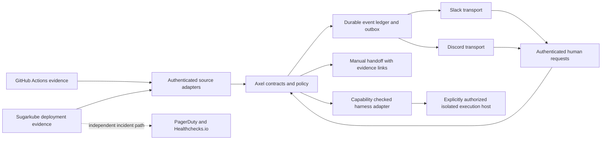

# Shared Slack and Discord operations design

## Status and scope

**Proposed, documentation only; reviewed 2026-10-07.** No integrations, accounts,
credentials, listeners, cluster access, or production authority are provisioned by
this document. All contracts below are proposed interfaces, not existing Axel APIs.

Use one Axel-owned core for deployment and CI notifications, task tracking, and
policy, with separate Slack and Discord transports and separate agent/harness
adapters. Start with notifications and human handoffs. The intended Discord home is
an owner's private server under a `todos` category; select actual guild, category,
and channel IDs before implementation. Slack destinations likewise need an explicit
owner-approved workspace/channel mapping. Names are display labels, not authority.

Sugarkube owns actual deployment, environment RBAC, verification, and rollback
runbooks. Its existing PagerDuty and Healthchecks.io paging design remains the
incident path; chat adds shared context, never replaces paging or acknowledges an
incident merely because somebody read or reacted to a message. No token.place
production process is changed. This design grants neither merges nor deployments.

## Existing behavior and boundaries

- [Discord ingestion](../discord-bot.md) and
  [its implementation](../../axel/discord_bot.py) capture mentioned messages, nearby
  context, and attachments, with search, summary, digest, and quest commands.
  This is not a deployment controller or a cross-platform authorization service.
  Markdown encryption is optional; existing attachments remain plaintext and legacy
  captures can remain plaintext. Reuse parsing ideas, not an assumption of secure
  end-to-end storage or cross-channel access control.
- [Remote Claude Code control](remote-claude-code-control.md) separates official
  Remote Control, private networking, and a constrained future Flipper supervisor.
  Preserve that separation. Chat is an additional status/task surface, not a new
  remote terminal, replacement mobile UI, or route into Sugarkube.
- [Working-hours guard](../HILLCLIMB.md#working-hours-guard) must run before every
  operational mutation, including after a queue resumes. Its current default blocks
  weekdays 09:00-17:00 America/Los_Angeles. A user's pause or stop deadline is an
  additional restriction, never relaxed by chat approval or scheduling. Read-only
  inspection may continue; queued work does not gain authority by waiting.
- Dots capabilities reported in the initiating session are public-channel reads
  and mentions, with private access limited to the current conversation. Automatic
  wake-up from another bot's post has **not** been verified. These are conservative
  session assumptions, not a public API or a general product guarantee. A private
  Discord server does not thereby become readable by Dots. Do not export private
  internal tool protocols or infer an externally callable Dots endpoint.

## Architecture and ownership

The core owns schema validation, canonical IDs, policy, task transitions, approvals,
redaction, audience checks, deduplication, audit, and durable delivery state. Each
transport owns its provider authentication, input normalization, message rendering,
thread mapping, and rate-limit handling. Each harness adapter owns supported task
submission/status/cancellation mechanisms and reports evidence, never policy grants.
Initially keep these as internal Axel modules and contract fixtures; extract a shared
package only when a second consumer needs it. Do not duplicate business rules in two
bots or require a message broker before a transactional local store is sufficient.

Sugarkube later produces a bounded event/evidence record through a separately reviewed
change; the Axel consumer does not scrape arbitrary cluster logs or run deployments
to discover their status. The app repository still owns builds and release artifacts.
Provider authentication proves origin, not that a CI log or artifact is trusted code.

## Proposed contracts

All records have a versioned schema, bounded sizes, UTC timestamps, and stable opaque
IDs. Validate enums and URLs; reject unknown major versions. Unknown additive metadata
must not affect routing or authorization. Persist normalized safe fields; raw payloads
are neither the task database nor instructions. Examples use symbolic IDs only.

| Record | Required fields and meaning |
| --- | --- |
| `Event v1` | `event_id`, `source`, `source_event_id`, `kind`, `occurred_at`, `observed_at`, `repo_id`, optional `app_id`, explicit `environment` (`none`, `staging`, `prod`), `correlation_id`, optional `causation_id`, `subject_id`, `revision`, `status`, `severity`, bounded `summary`, `evidence_refs`, `classification`, `audience_policy_id`. |
| `Task v1` | `task_id`, `version`, `origin_event_ids`, `requester_principal_id`, `owner_principal_id`, `repo_id`, explicit environment, `intent`, allowlisted `action_profile_id`, immutable `input_digest`, `required_capabilities`, `harness_id`, `state`, `deadline`, `policy_version`, and `evidence_refs`. No shell string, arbitrary host, path, or environment-variable bag. |
| `Approval v1` | `approval_id`, `task_id`, `task_version`, `input_digest`, action/environment/repository scope, `approver_principal_id`, `decision`, `issued_at`, `expires_at`, `nonce`, `policy_version`, and durable consumption/revocation state. A scoped decision, never a reusable bearer credential. |
| `Delivery v1` | `event_id`, destination ID, rendered revision/digest, `delivery_key`, state, attempt count, next attempt time, provider receipt/message/thread IDs, last safe error, and audience-policy version. Separate from task success. |

`source_event_id` identifies a logical source occurrence, stable across delivery
retries and reconciliation; raw webhook delivery IDs are separate audit metadata.
For GitHub, derive it from repository/run/attempt and job ID where applicable; for
deployments, use the producer's operation ID. `revision` is the source adapter's
ordered version for that subject, not the code SHA. Define ordering per source and
reconcile incomparable observations before changing current state. The canonical
deduplication key is `(source, source_event_id, kind, revision, status)`; producers
must preserve these fields when retransmitting the same observation.

Event kinds include `deployment.started`, `deployment.completed`,
`deployment.failed`, `deployment.verification_failed`, `ci.failed`, `ci.recovered`,
`task.changed`, and `approval.requested`. Deployment completion requires the
producer's final verification evidence; workflow success alone cannot assert it.
Represent cancelled, skipped, timed-out, unknown, and superseded states explicitly.

Source-specific evidence includes GitHub repository ID, workflow ID, run ID, attempt,
job/check URL, full commit SHA, and ref; deployment evidence includes operation ID,
application, environment, source revision, image/chart identity and immutable digests
when supplied, verification outcome, and the canonical Sugarkube evidence/runbook
links. Missing proof means `unknown` or `verification_failed`, never invented success.
Do not copy secret values or raw command output into the shared schema.

Task progression is `proposed -> awaiting_approval -> queued -> running ->
succeeded|failed|cancelled|unknown`; notification-only records need no executable
task. `paused` and `blocked` record a reason and previous state. Every transition uses
compare-and-swap on task version. Reject stale/out-of-order transitions; preserve
their evidence in the audit history. Cancellation is a request until the harness
confirms it. A timeout or lost connection after dispatch is `unknown`, not permission
to execute again. Reconcile by the stable task ID before any retry.

Approval binds the exact reviewed inputs and task version. At dispatch, atomically
consume it and reserve the task execution key; recheck identity, current permissions,
expiry, revocation, evidence freshness, working hours, and deadline. Changed inputs
require a new approval. One winning approval across Slack and Discord consumes the
same canonical record; button text, emoji, an agent's recommendation, and a copied
approval message convey no authority. Phase one exposes no approval buttons.

## Transport adapters and audience

| Capability | Slack adapter | Discord adapter |
| --- | --- | --- |
| Notification MVP | Bot posting to allowlisted channels with durable returned message IDs; incoming webhooks are a simpler option only if receipt/thread limitations are accepted. | Dedicated bot posting to allowlisted text channels under `todos`; a notification webhook is possible but is not an interactive bot. |
| Conversation mapping | One root message per correlation/destination and replies using `thread_ts`; reserve root creation in the store. | One root and an explicit thread where supported and permitted; otherwise bounded replies in the configured channel. A category is a container, not a message destination. |
| Inbound request, later | Explicit command/mention or authenticated interaction; verified HTTP signatures and timestamp, or a separately validated Socket Mode session. | Explicit application command/mention; validate HTTP interaction signature when using HTTP, or authenticated Gateway event context. Use the chosen SDK's supported acknowledgement/defer path. |
| Minimal access | Only required posting scope and invited channels initially; add event/history scopes only for approved inbound capabilities. | Only selected guild/channel access and required send/thread permissions; no Administrator. Request Message Content intent only if the chosen mention-capture behavior requires it. |

Map destinations by immutable workspace/guild/channel IDs and allowed audience, not
matching repository names. For Discord, check category permission inheritance and
channel overrides, including future moves. Neither `todos` nor a private guild proves
that every member may read every repository. Deny unknown or changed audiences until
revalidated. A thread inherits the destination's effective policy; it is not a new
security boundary. Search/summaries must filter by the requester's currently authorized
source channels, including existing local captures, before producing even a snippet.

New captures must persist immutable provider/workspace or guild/channel/thread/message
IDs and capture-time audience policy. Existing name-only captures are ineligible for
chat search or agent export until an owner-controlled migration verifies their original
IDs and audience against authoritative source records. Never infer provenance from a
channel name, repository name, or user-supplied link. Missing/deleted source records or
ambiguous migration fail closed; keep those captures local and excluded from results.

Cross-posting is opt-in per event class and destination pair. A recipient on Slack
does not automatically have access to private Discord context or vice versa. Render
only the intersection of the event's allowed audience and the destination policy;
otherwise deliver a safe restricted-status notice or withhold delivery. Recheck before
each send/retry. Never broaden a source's audience to make an agent integration work.
Suppress mass mentions and link unfurls; allowlist evidence-link hosts and redact URL
credentials/query secrets. Link visibility is checked separately from message text.

## Agent and harness adapters

A capability declaration is locally configured and verified, with `adapter_id`,
version, supported operations, environments, evidence visibility, authentication mode,
working-hours behavior, and `verified_at`. Unknown capabilities are false. Discovery
or a model's claim is not authorization. The core intersects advertised capabilities
with owner grants and current policy before dispatch.

| Consumer | Initial usable boundary | Deferred capability gate |
| --- | --- | --- |
| ChatGPT Dots | Human supplies a minimal redacted task/evidence summary or an allowed public-channel mention; private reading remains current-conversation-only under the reported session limits. | Verify a documented, supported integration and its audience/wake-up behavior with a harmless owner-controlled test. Until then `submit_task`, automatic bot-post wake, status callbacks, and cancellation are unsupported. No public Dots API is assumed. |
| Axel harness | Existing task/quest/CLI facilities can inform a manual handoff in an isolated checkout. This document adds no running dispatcher. | Implement explicit bounded submission, stable task IDs, evidence-backed status, cancellation acknowledgement, and working-hours enforcement before advertising them. |
| Other agent harness | Manual handoff with task ID, objective, scope, evidence links, restrictions, and expected result. | Adapter for that product's supported interface, identity, permissions, and lifecycle; never generic shell execution disguised as an adapter. |
| Claude Code remote session | Continue through the existing official UI and host permissions described in the remote-control design. | Separately reviewed supervisor integration if needed; chat cannot bypass the official/local approval boundary. |

The manual bridge is a supported outcome: display a handoff packet and mark the task
`blocked: manual_handoff_required`; a human opens the chosen agent, provides approved
context, and later attaches result evidence. It must not claim an agent was awakened.
Agent output remains a proposal until evidence and policy validate it. Ignore bot and
webhook posts as commands by default; allowlisted machine events may create notices
but never human approvals. Record origin and hop count to prevent bot-to-bot loops.

## Deployment and CI notification policy

| Situation | Shared message and action boundary |
| --- | --- |
| Staging deployment | One compact start/update/completion thread, app/environment/SHA/digests, operator or producer identity, verification evidence and runbook link. Routine checks stay lightweight and bounded; summarize repeats. |
| Production deployment | Prominent `prod` label, approved release identity, staging evidence link, rollout status and careful production smoke evidence. Failure or uncertainty stays visible. No chat-driven promotion or rollback. |
| GitHub Actions failure | First failure for an allowlisted workflow/ref opens or updates one thread, with failed jobs and source links. Logs, PR text, and artifacts are untrusted. Do not download or execute artifacts to render notifications. |
| CI recovery | Require authoritative successful completion in the same workflow/ref incident scope and a later run/attempt; link the failure and successful run. A success for another branch or an older completion cannot close it. |
| Flapping or repeated failure | Coalesce identical failure fingerprints, show count/last seen, and issue a bounded digest. Preserve meaningful severity changes and terminal states. Cancelled/skipped is not recovery. |
| Operational incident | Link existing incident/runbook context when authorized. Chat delivery, task completion, and incident acknowledgement/resolution are separate states; PagerDuty/Healthchecks.io behavior remains owned by Sugarkube. |

Keep incident grouping separate from deduplication: a CI group uses repository,
workflow, and ref/PR identity; individual events use run ID, attempt, job/transition
identity. A deployment group uses app, environment, and operation ID. A release-level
correlation can relate CI to deployment through verified SHA/digests, but not conflate
staging and production success. Never correlate solely on message text or timestamps.

Quiet hours govern routine chat noise; mutation pauses govern execution. During a
pause, accept safe evidence and queue a digest, visibly mark tasks paused, and do not
start mutation work. Critical incident routing remains the existing paging system.
Do not automatically resume a production action or retry an expired staging approval
at the end of a pause. Owners choose notification cadence and severity thresholds.

## Delivery, replay, and rate limits

Authenticate and bound input before enqueueing. Acknowledge valid provider events
promptly after durable acceptance, within the current provider deadline; business work
runs asynchronously. Use the canonical Event v1 deduplication key as a unique constraint
and one transaction for accepted event, task transition, and outbox intents. Each
destination has its own delivery key and retry state; Slack failure cannot roll back
a successful Discord delivery or cause a second task execution.

At-least-once delivery is the design assumption. Persist provider receipts and thread
mappings before claiming delivered. A crash after a provider accepted a message but
before saving its receipt is ambiguous: reconcile with provider-supported identifiers
or history only when permitted; otherwise flag uncertain delivery for operator review.
Do not promise exactly-once chat posting or blindly repeat actionable notices. Edits
update status summaries, with append-only safe audit metadata preserving transitions.
Deleted/archived threads require an owner-approved fallback destination, never a public
channel chosen automatically. A replacement root references the canonical task ID.

Honor provider retry-after and bucket/global limits, bounded exponential backoff with
jitter, per-destination queues, concurrency limits, and configured queue capacity.
Coalesce progress before it floods chat; prioritize failures/recoveries over routine
success. Invalid permission/authentication is a blocked delivery needing operator
attention, not an infinite retry. Expired events become a labelled catch-up digest;
do not silently drop terminal outcomes when a queue fills. Persist backlog state and
expose delivery lag, oldest pending age, retry counts, and dead-letter counts locally.

GitHub does not automatically redeliver failed webhooks. Use an owner-approved bounded
reconciliation window and read-only API cursor with overlap, plus explicit redelivery
where supported. Compare source run/deployment state with the durable ledger, dedupe
recovered events, and label them late. A source outage or retention gap means unknown
coverage, not healthy CI. Replaying notifications never replays approvals or execution.
Restart/backup restore must retain consumed approval IDs and execution reservations;
if freshness cannot be established, fail closed and reconcile with an operator.

## Identity, security, and retention

Bind principals to immutable provider user IDs within the workspace/guild, then link
cross-platform identities only through an owner-controlled verification procedure.
No display-name matching. Keep roles for viewer, task requester, approver, operator,
and policy administrator distinct; deny by default, and recheck revoked roles at use.
Bot identity, app signature, and channel membership alone never authorize execution.
Separate source-read, chat-write, and harness credentials; scope installations to the
selected repositories/channels. Future credentials need rotation/revocation procedures
and secure storage, but none are created by this proposal.

Treat all bot messages, user content, CI logs, attachments, linked pages, task results,
and repository instructions as untrusted data at the integration boundary. Keep them
outside trusted policy and fixed action profiles. No instruction in a failed job can
grant tools, change an allowlist, request a credential, or approve a command. Disable
automatic attachment downloads and arbitrary URL fetching in the notification path.
Test prompt injection, forged bot identities, edited messages, replay, and cross-tenant
IDs. Production execution capability is absent, not merely hidden in the UI.

Persist audit metadata for origin verification, principal, policy version, decisions,
state changes, input digest, delivery attempts/receipts, and evidence references. Limit
readers and make changes tamper-evident; do not retain credentials, raw prompts, private
message bodies, full CI logs, or attachments by default. Redact before persistence,
rendering, and model handoff, not just in the final chat message. Redaction tests must
include signed URLs, webhook/heartbeat URLs, kubeconfigs, and tokens in error text.

Proposed retention for owner approval: 30 days for safe event/delivery metadata and
90 days for decision audits, with encrypted storage/backups and verified expiry.
Deduplication tombstones must outlive the configured source replay horizon; consumed
approval/execution records must survive their replay risk or trigger fail-closed
re-enrollment on restore. Chat-provider retention is separate and must be documented;
deleting local records cannot promise deletion of copies or provider history. Deletion
requests must cover captures, attachment stores, exports, and backups where applicable.
Do not ship a new capture path until retention, audience, and deletion owners agree.

## Phases and owner decisions

1. **Design and fixture review:** agree schemas, owners, supported sources, destination
   IDs, audience policy, budget, retention, quiet hours, and the manual Dots bridge.
   Record unsupported capabilities explicitly. No account or credential provisioning.
2. **Notification-only prototype:** synthetic events through the shared core and both
   transports in owner-approved test channels; no real private payloads or commands.
   Validate failure/recovery ordering, delivery ambiguity, redaction, and replay first.
3. **Read-only operational pilot:** separately approve source reads and chat posting;
   Sugarkube adds its producer/crosslink in its own PR. Observe staging deploys and CI
   with lightweight checks and visible gaps. Production can receive evidence-only
   notifications after audience review; it acquires no execution capability.
4. **Task coordination:** authenticated requests, manual handoffs, bounded harness
   adapters, and approvals tested without infrastructure mutation. Unsupported Dots
   operations remain manual. Demonstrate pause, cancellation, and unknown-outcome paths.
5. **Optional least-privilege staging access:** a separate owner decision, conditional
   on reliable shared visibility of intent, approval, evidence, and results. Sugarkube
   owns namespace/action-specific RBAC and runbooks. Start read-only; any later bounded
   mutation needs short-lived scoped access, no secrets/exec/admin permission, exact
   inputs, independent local guards, audit, revocation/kill switch, tested recovery,
   and no production reachability. If visibility fails, dispatch fails closed.

Production command authority requires a new design and explicit authorization outside
these phases. Cautious future commands should be structured `status`, `request_task`,
or `cancel_task` actions with fixed profiles; free-form deploy/rollback/shell commands
are excluded. Chat approval never replaces Sugarkube's release gates or careful rollout
and smoke checks. Do not weaken existing staging verification to reduce routine noise.

Open decisions and accountable owners:

| Decision | Owner required before the relevant phase |
| --- | --- |
| Actual Slack workspace/channel IDs and private Discord guild/`todos` child channels; cross-post audience | Chat owner, before any delivery |
| Event producer and immutable deployment evidence source; staging RBAC, release and rollback gates | Sugarkube maintainer, before operational pilot/access |
| Hosting, durable store, queue/replay bounds, availability and delivery-gap escalation | Axel maintainer, before pilot |
| Verified Dots interface/wake behavior, permissible context, manual handoff workflow | User and integration owner, before automated dispatch |
| Identity linking, role grants, approval TTL, reapproval after pause | Security/operations owner, before task commands |
| Noise thresholds, routine check budget, quiet hours, retention/deletion and costs | User and data owner, before real payloads |

## Acceptance tests for future implementation

These are implementation gates, not claims that a live integration has been tested.

| Scenario | Required evidence |
| --- | --- |
| Same fixture over Slack and Discord | Equivalent canonical status, safe evidence links, environment, correlation and task IDs; only rendering differs. |
| Duplicate/out-of-order CI events | One logical transition; old successes, other refs, cancelled/skipped runs cannot resolve the current failure. A later matching success produces one recovery. |
| Staging and prod share a SHA | Separate deployment operation/state; no staging success reported as production proof. Missing smoke evidence remains unknown/failed. |
| 429, network failure, restart, send-before-receipt crash | Backoff/buckets honored; durable backlog retained; uncertain sends reconciled or flagged without repeating execution. |
| Lost webhook and source outage | Bounded reconciliation recovers late notices; gap/lag remains visible; no false healthy status. |
| Concurrent approvals in both transports | One reservation and consumption; expired, revoked, edited-input, wrong-user/tenant, and replayed approvals denied. |
| Permission removal or channel move | Pending sends and capture search recheck audience; no cross-channel snippet leak or automatic public fallback. |
| Host crash or failed cancellation | Task becomes unknown until authoritative reconciliation; cancellation is not falsely reported complete. |
| Bot loop, forged identity, malicious log/attachment | No human authority inferred, no command execution or arbitrary fetching, bounded hops and redacted safe output. |
| Pause, deadline, or unavailable guard | Mutation dispatch blocked, including queued/retried work; routine digest deferred; existing paging unaffected. |
| Dots cannot read destination or wake | Explicit unsupported capability and usable manual packet; no widened audience or invented API. |
| Retention/restore/revocation drill | Expiry verified across local stores/backups; replay tombstones retained or service fails closed; credential removal blocks further activity. |
| Conditional staging access | Shared intent/result visibility, narrow RBAC and kill switch proven; denied secrets/exec/admin and prod access; Sugarkube rollback responsibility unchanged. |

## Source map and crosslinks

Repository behavior was inspected at Axel commit
`32c5c6975cd806870a8ae0fb319d4661e7c69ee7`. External platform documentation was checked
on 2026-10-07; revalidate scopes, deadlines, limits, and product capabilities before
implementation. The retention durations and rollout phases above are design choices.

- [Axel Discord guide](../discord-bot.md), [threat model](../THREAT_MODEL.md),
  [remote-control design](remote-claude-code-control.md), and
  [working-hours implementation](../../axel/working_hours.py).
- [Sugarkube app deployment contract](https://github.com/futuroptimist/sugarkube/blob/main/docs/app_deployment_contract.md):
  artifact/environment ownership and release verification gates.
- [Sugarkube alerting](https://github.com/futuroptimist/sugarkube/blob/main/docs/observability-alerting.md)
  and [operations](https://github.com/futuroptimist/sugarkube/blob/main/docs/observability-operations.md):
  authoritative PagerDuty/Healthchecks.io status, procedures, and remaining drills.
- [Sugarkube app runbooks](https://github.com/futuroptimist/sugarkube/tree/main/docs/apps):
  app-specific deployment and rollback, rather than generic chat commands.
- [Slack Events API](https://docs.slack.dev/apis/events-api/),
  [request verification](https://docs.slack.dev/authentication/verifying-requests-from-slack/),
  and [posting/threading](https://docs.slack.dev/reference/methods/chat.postMessage/).
- [Discord interactions](https://docs.discord.com/developers/interactions/receiving-and-responding)
  and [rate limits](https://docs.discord.com/developers/topics/rate-limits).
- [GitHub workflow events](https://docs.github.com/en/webhooks/webhook-events-and-payloads#workflow_run)
  and [failed delivery handling](https://docs.github.com/en/webhooks/using-webhooks/handling-failed-webhook-deliveries).

Recommend a later Sugarkube deployment-contract/observability crosslink to this design
once owners accept the producer boundary. Keep actual RBAC and deploy/rollback details
there. No Sugarkube edit is necessary for this design-only PR.
