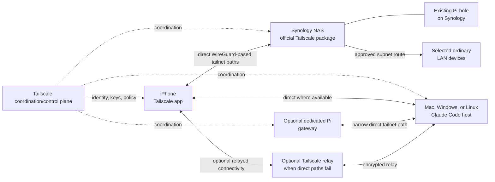
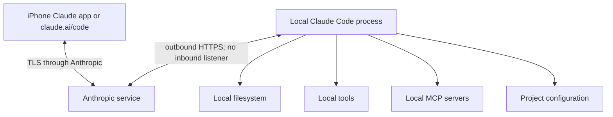
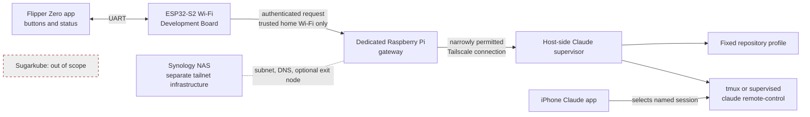

# Remote Claude Code control design

## Status and executive summary

- **Status:** proposed design
- **Last reviewed:** 2026-08-11
- **Implementation status:** documentation only; no deployment or physical Flipper
  integration has been tested.

The recommended sequence is: use official Claude Code Remote Control first; create a
basic tailnet; add deliberately scoped LAN routing and Pi-hole DNS; optionally add an
exit node; then, only if useful, prototype a local-only Flipper gateway on a dedicated
Raspberry Pi and harden it. Keep all of this separate from Sugarkube.

The key decisions are:

| Capability | Decision and boundary |
| --- | --- |
| Official Claude Code Remote Control | Recommended first milestone and normal remote UI. The local process makes outbound HTTPS connections to Anthropic, opens no inbound listener, and **does not require Tailscale**. |
| Ordinary tailnet access | An orthogonal private-network layer for directly managed devices such as the iPhone, NAS, development host, and future gateway. |
| Subnet routing | Provides access only to approved private LAN prefixes and devices that cannot join the tailnet. |
| Exit-node routing | Optionally routes the phone's general internet traffic through home; it is distinct from and unnecessary for subnet access or Remote Control. |
| Pi-hole DNS | Optionally makes the existing Pi-hole a tailnet global nameserver after reachability and failover testing. |
| Custom Flipper gateway | A later, local-network-only, allowlisted button interface. The Flipper and stock ESP32-S2 board are low-trust, non-tailnet devices; a dedicated Pi is preferred for the gateway. |

Initially, the Synology NAS is the always-on Tailscale node, optional subnet router,
Pi-hole host, and optional exit node. Claude Code runs only on an explicitly selected
Mac, Windows workstation, or Linux machine. A gateway must never silently make the NAS
an unrestricted execution host. Tailscale can protect gateway-to-host backhaul, but it
does not protect the Flipper-to-gateway Wi-Fi hop. Tailscale Funnel is excluded from
the MVP because it creates public ingress and requires a separate threat model.

## Goals and non-goals

### Goals

- Control or continue a local Claude Code session from an iPhone.
- Reach selected home services securely while away from home.
- Optionally route DNS through the existing Pi-hole.
- Optionally route general internet traffic through a home exit node.
- Provide a narrowly scoped Flipper control surface later.
- Preserve strong boundaries between personal automation, Sugarkube, and unrestricted
  shell access.
- Make loss or theft of the Flipper low impact.

### Non-goals

- Reimplement Claude Code Remote Control.
- Make Tailscale mandatory for official mobile Remote Control.
- Give the Flipper a general-purpose terminal or accept free-form prompts from it.
- Publicly expose a Claude control API.
- Run this system, its secrets, or its deployment resources inside Sugarkube.
- Depend on remote connectivity for local safety or host integrity.
- Treat `.local` multicast DNS names as guaranteed across routed networks.

## Terminology

- **Tailnet:** the private network Tailscale creates when devices authenticate into the
  same network. It is not a separate Kubernetes cluster or a manually assembled VPN
  cluster.
- **Tailscale node:** an authenticated device running a supported Tailscale client.
- **MagicDNS:** Tailscale DNS naming for tailnet nodes.
- **Subnet router:** a Tailscale node advertising selected non-tailnet IP prefixes.
- **Exit node:** a node selected to carry a client's general non-tailnet internet
  traffic.
- **Tailscale Serve:** tailnet-only proxying of a local service, commonly with the
  backend bound to loopback.
- **Tailscale Funnel:** deliberate public-internet exposure of a service through
  Tailscale infrastructure; it is not used in the MVP.
- **Claude Code Remote Control:** Anthropic's official facility for connecting web or
  mobile clients to a locally running Claude Code process over Anthropic's service.
- **Gateway:** the proposed dedicated Pi service that accepts only authenticated,
  allowlisted actions and relays them to the supervisor.
- **Host-side supervisor:** a constrained service on the Claude execution host that
  maps fixed profiles to bounded processes or `tmux` sessions.
- **Flipper app:** a future Flipper Zero application that presents buttons and status,
  communicating over UART; it is not a shell or Claude conversation UI.
- **ESP32-S2 Wi-Fi Development Board:** the stock Flipper development board that
  bridges UART to trusted home Wi-Fi. This design does not assume it can run a
  supported Tailscale client.

## Official Claude Code phone workflow

Requirements in this section are volatile. Confirm account eligibility, plan and
organization policy, supported platforms, minimum version, commands, and privacy terms
against the [current official Remote Control documentation][claude-remote] at
implementation time.

Check the installed version and authenticate with a claude.ai account:

```sh
claude --version
claude auth login
```

Authentication can also be performed by starting `claude` and entering `/login`.
Remote Control requires a claude.ai login; API-key-only authentication is not enough.

1. Install the official “Claude by Anthropic” iOS app.
2. Sign into the same account and organization used by Claude Code.
3. Update Claude Code if the installed version predates Remote Control support.
4. Run Claude Code in the project directory at least once and accept workspace trust.
5. Start a supported Remote Control mode:

```sh
# Server mode, suitable for accepting remote sessions
claude remote-control --name "Axel"

# Normal interactive terminal session that is also remotely accessible
claude --remote-control "Axel"
```

From an already running interactive session:

```text
/remote-control Axel
```

Connect by opening the displayed session URL or scanning its QR code. Alternatively,
open the Claude iOS app, select **Code**, and select the online computer-backed
session. The same conversation can continue in the terminal, browser, or phone.
Remote Control at startup and mobile push notifications can optionally be enabled
through `/config`.

The local `claude` process must remain running. Use `tmux` or `screen` on a persistent
Linux host if it must survive an SSH disconnection. A sleeping or powered-off host is
unavailable until it returns. Execution, filesystem access, tools, MCP servers, and
project configuration remain on that host. While Remote Control is active, session
messages, responses, and tool activity are synchronized through and stored by
Anthropic subject to its current data policy. Some terminal-only interactive commands
are unavailable from mobile. The connection is outbound HTTPS; no inbound firewall
rule is required.

The [official mobile link scheme][claude-mobile-links] is optional convenience, not
the core control mechanism:

```text
claude://code
claude://code/{session-id}
claude://code/new
```

A future iOS Shortcut or phone companion could open these links. This design does not
claim the Flipper can invoke them directly without a phone-side integration.

## Tailnet architecture



The control plane distributes identity, policy, and connection information; payload
paths are direct peer-to-peer where possible and may use an encrypted relay when
direct connectivity is unavailable.

### Direct node access

Install Tailscale on the iPhone, Synology NAS, Claude host, and every other directly
managed device. Use stable Tailscale IPs or MagicDNS names. Prefer direct node
membership over subnet routing whenever the target supports Tailscale.

### Subnet router

Discover the actual home LAN CIDR from the current router and advertise only that
prefix; never copy an example CIDR blindly. Approve the route in the Tailscale admin
console and permit it in policy. Use it only for LAN devices that cannot run Tailscale.
Access by LAN IP should work when routing, host firewalls, return paths, and policy are
correct.

Current [Synology integration documentation][tailscale-synology] describes DSM hybrid
networking behavior, no Tailscale SSH support on Synology, and caveats around outbound
tailnet connectivity from other packages and containers. Confirm the DSM version and
required configuration during deployment rather than assuming ordinary Linux
networking behavior.

Names ending in `.local` use multicast DNS and generally do not cross routed
tailnets. `flipper.local` may work on home Wi-Fi, but it is not the remote-access
contract. Use a Tailscale IP, MagicDNS for a tailnet node, a stable LAN IP, or a normal
Pi-hole DNS record for a LAN-only service.

### Pi-hole DNS

1. Make Pi-hole reachable from relevant tailnet clients on **TCP and UDP port 53**.
2. Add its reachable Tailscale or routed LAN address as a custom global nameserver in
   Tailscale DNS settings.
3. Confirm grants permit DNS and keep MagicDNS enabled for tailnet node names.
4. Test before selecting **Override DNS servers**:

   ```sh
   dig @<PIHOLE_TAILSCALE_OR_LAN_IP> example.com
   nslookup example.com <PIHOLE_TAILSCALE_OR_LAN_IP>
   ```

5. Enable override only after validation, so a Pi-hole outage does not unexpectedly
   strand all DNS resolution; document how to turn override off.

Synology Container Manager port publishing and the DSM firewall must be validated,
not assumed. On iOS, where command-line DNS tools are not normally present, verify
queries in the Pi-hole query log and use a known blocked test domain. Test both
successful resolution and recovery after disabling Pi-hole or Tailscale.

### Optional exit node

A subnet router reaches selected private prefixes; an exit node routes general
non-tailnet internet traffic through home. An exit node is unnecessary for Remote
Control, LAN access, or Pi-hole DNS. The NAS or a dedicated Pi may advertise exit-node
routes, which an administrator must approve. The iPhone must explicitly select the
exit node. **Allow LAN access** controls whether it can still reach its current
physical LAN while doing so.

Compare the iPhone's public IP with and without the exit node and test local-LAN
behavior. While selected, the home uplink and exit-node device become availability
dependencies.

## Official Remote Control security boundary



Tailscale is not in this path. The local host does not open an inbound Remote Control
port. Anthropic authenticates and synchronizes the remote experience; local Claude
Code retains the execution boundary and local permissions.

## Flipper gateway architecture



The Flipper and stock ESP32-S2 are treated as non-tailnet, low-trust devices. The
first prototype is local-network-only. Tailscale protects only the Pi-to-host
backhaul, not the Flipper-to-Pi hop unless a future companion itself joins the
tailnet. The Flipper is a button panel and status display, not the Claude UI. The
official iPhone app remains the place for conversation, permissions, diffs, and
detailed status. Synology remains separate infrastructure, and Sugarkube is untouched.

## Proposed Flipper action protocol

The eventual allowlist is `status`, `start_session` with a fixed `profile_id`,
`stop_session` with a fixed profile or gateway-returned session identifier,
`list_profiles`, and `list_sessions`. The MVP exposes only `status` and one
`start_session` profile.

A server-side profile fixes the repository, checkout path, session name, permission
mode, supervisor unit, maximum concurrent sessions, and allowed execution host. The
Flipper cannot supply shell text, a working-directory path, an arbitrary Git URL,
branch name, free-form Claude prompt, environment variables, permission-bypass flags,
arbitrary process signals, or arbitrary session IDs not returned by the gateway. It
never receives Claude or Tailscale credentials.

Protocol requirements, to be implemented with reviewed libraries rather than a custom
cryptographic primitive, are:

- HTTPS where feasible for the LAN endpoint.
- A per-device application credential on the ESP32-S2. Treat flash secrets as
  recoverable after theft and make rotation routine.
- A short-lived gateway challenge or nonce, monotonic request counter, canonical
  request encoding, and HMAC-SHA-256 (or equivalently reviewed authenticated-request
  mechanism).
- Replay rejection, strict request-size limits, rate limits, and idempotency keys for
  start/stop actions.
- An audit record of action, device identity, result, and request ID, but no secrets,
  prompt text, or repository contents.
- Explicit physical confirmation on the Flipper for state-changing actions, a local
  gateway kill switch, and credential rotation after loss or theft.

## Gateway and host-side supervisor

- Run the gateway as an unprivileged, isolated service with no unrestricted SSH key.
- Restrict `tag:claude-gateway` through Tailscale grants to only the supervisor port.
- Bind the supervisor only to the Tailscale interface, or to localhost behind
  Tailscale Serve. Serve may publish a tailnet-only administrative/status UI while its
  backend stays on loopback.
- Tailscale identity headers may supplement human tailnet-client authorization; they
  do **not** authenticate the non-tailnet Flipper's LAN request.
- Validate a fixed profile and start only a bounded service or `tmux` session. Never
  concatenate user-controlled strings into a shell command; use argument arrays or
  fixed service units.
- Enforce concurrent-session limits and timeouts. If the selected host is stopped or
  unreachable, return a safe error instead of trying another host.
- Use deterministic session names that are easy to locate in the Claude app.

Before implementation, confirm how supported Claude Code output exposes session URLs
or IDs. Do not rely on undocumented Anthropic APIs or brittle terminal screen scraping
when no supported interface exists.

## Placement comparison and recommendation

| Placement | Strengths | Constraints |
| --- | --- | --- |
| Synology NAS | Already always on; official Tailscale package; already hosts Pi-hole; suitable for subnet routing and optional exit-node duty. | DSM sandbox and package networking behavior; packages may not make outbound tailnet connections by default; no Tailscale SSH; custom service supervision and debugging are awkward. |
| Dedicated Raspberry Pi | Full Linux, systemd, simple logs and upgrades, clean isolation from NAS and Sugarkube, straightforward policy/tagging; best initial custom-gateway location. | Another device to power, patch, back up, and monitor. |
| Claude execution host | Has repositories, toolchains, credentials, MCP servers, and required compute. | Sleep, reboot, user login, and workspace state affect availability. |

**Recommendation:** Synology provides Tailscale, subnet routing, Pi-hole, and optional
exit-node duty. A dedicated Pi hosts the future gateway. An existing selected
development machine executes Claude Code. Official Claude iOS Remote Control is the
normal remote interface.

## Access-control policy

The following **schematic, non-copy-paste example must be adapted** to current
Tailscale policy syntax and real identities, tags, IPs, ports, and CIDR. It expresses
intent rather than a deployable policy:

```jsonc
{
  "tagOwners": {
    "tag:synology": ["group:admins"],
    "tag:pihole": ["group:admins"],
    "tag:claude-gateway": ["group:admins"],
    "tag:claude-host": ["group:admins"]
  },
  "grants": [
    {"src": ["group:owner-devices"], "dst": ["tag:synology"], "ip": ["tcp:<APPROVED-NAS-PORTS>"]},
    {"src": ["group:owner-devices"], "dst": ["tag:pihole"], "ip": ["tcp:53", "udp:53"]},
    {"src": ["group:owner-devices"], "dst": ["tag:claude-gateway"], "ip": ["tcp:<STATUS-UI-PORT>"]},
    {"src": ["group:owner-devices"], "dst": ["tag:claude-host"], "ip": ["tcp:<EXPLICIT-MANAGEMENT-PORTS>"]},
    {"src": ["group:owner-devices"], "dst": ["<APPROVED-HOME-CIDR>"], "ip": ["tcp:<APPROVED-LAN-PORTS>"]},
    {"src": ["tag:claude-gateway"], "dst": ["tag:claude-host"], "ip": ["tcp:<SUPERVISOR-PORT>"]}
  ],
  "autoApprovers": {
    "exitNode": ["group:admins"]
  }
}
```

There is intentionally no gateway-to-LAN grant and no general inbound grant to the
Claude host. DNS is limited to port 53. Exit-node use and route approval must be
separately authorized; confirm the precise current policy controls before deployment.

Require MFA at the identity provider, device approval, appropriate node-key expiry,
and immediate revocation of lost devices. Use tagged server auth keys that are one-off
or securely injected, never embedded in an image or firmware. Consider Tailnet Lock
only after understanding recovery keys and signing-node requirements.

## Threat model

| Threat | Mitigations | Residual risk |
| --- | --- | --- |
| Stolen iPhone | Device passcode/biometrics, MFA, device approval, remote wipe, revoke Tailscale node and Claude sessions. | An unlocked device may act before revocation. |
| Stolen Flipper or Wi-Fi board | Narrow credential, physical confirmation, allowlist, kill switch, prompt rotation drill. | ESP32 credential is assumed extractable. |
| Extracted ESP32 credential | Per-device key, nonce/counter, rate limit, immediate rotation. | Attacker can impersonate that board until revocation. |
| Replayed request | Short challenge, monotonic counter, expiry, idempotency and replay cache. | State loss or clock/counter bugs can weaken rejection. |
| Malicious LAN client | Authenticated requests, HTTPS where feasible, listener firewall, size/rate limits. | LAN compromise still enables denial of service attempts. |
| Compromised gateway | Unprivileged isolation, no shell key, narrow tailnet grant, fixed API. | Can request allowed actions until revoked. |
| Compromised Claude host | Host hardening, least Claude permissions, credential hygiene, patches. | Repositories, tools, and local credentials may be exposed. |
| Compromised Tailscale account | IdP MFA, device approval, admin separation, alerting, Tailnet Lock evaluation. | Account control may permit policy/device changes. |
| Overly broad grants | Default deny, review tests, tags owned only by admins, explicit ports/CIDRs. | Policy mistakes can expose internal services. |
| Accidental Tailscale Funnel exposure | Do not use Funnel in MVP; inspect and disable configuration; separate threat model. | Public ingress exists until discovered and removed. |
| DNS outage | Test before override, retain recovery steps, monitor Pi-hole, disable override. | Name resolution fails while override targets are unavailable. |
| Exit-node outage | Explicit opt-in, documented deselection, monitoring. | Internet access fails or degrades while selected. |
| Host sleep or reboot | Persistent selected host, supervisor restart policy, safe unavailable response. | Sessions remain unavailable during downtime. |
| Stale Remote Control session | Timeouts, named-session inventory, stop local process when done. | Anthropic-side synchronized data follows current retention policy. |
| Command injection | No raw fields, fixed profiles/units, argument arrays, strict parsing. | Implementation defects remain possible. |
| Unrestricted Claude permissions | Fixed least-privilege mode and human review in official app; no bypass flags. | Approved tools may still have meaningful local impact. |
| Session-start flood | Rate/concurrency limits, idempotency, quotas and timeouts. | Allowed capacity can still be exhausted. |
| Secrets appearing in logs | Structured allowlisted fields, redaction, access controls, retention limits. | Bugs or upstream logs may leak sensitive context. |
| Physical attacker pressing Flipper buttons | Confirmation gesture, inactivity lock, narrow actions, local-only range. | Attacker can start the single allowed profile before revocation. |

## Failure and revocation runbook

- **Lost iPhone:** remove it from the Tailscale admin console, revoke active Claude
  account sessions using current account controls, change credentials if compromise is
  suspected, and remote-lock/wipe the phone.
- **Gateway or Claude host:** disable its tagged auth key, expire/remove the node, and
  remove its grants; investigate before reenrollment.
- **Flipper credential:** disable its device identity at the gateway, issue a new
  per-device application credential through a local trusted process, reset the
  counter/replay state safely, and audit recent request IDs.
- **LAN gateway listener:** activate the local kill switch, stop/disable the service,
  and block its port at the Pi firewall.
- **Serve or Funnel:** inspect current `tailscale serve`/`tailscale funnel` status and
  use the documented reset/off command; confirm from another device that exposure is
  gone. Funnel should already be absent.
- **Subnet route:** disable route advertisement on the NAS and/or unapprove the route
  in the admin console, then confirm the LAN prefix is unreachable remotely.
- **Exit node:** deselect it on the iPhone, disable advertisement or approval, and
  verify normal public connectivity returns.
- **Claude sessions:** stop the fixed supervisor unit or named `tmux` session; confirm
  the process and app session disappear.
- **Remote Control:** enter `/remote-control` as documented to disable it for an
  interactive session, or terminate the local `claude` process/server mode; verify the
  session is offline.
- **Logs:** restrict readers, query by request ID/device/action/result, redact before
  sharing, and never export credentials, prompts, repository contents, or environment
  values.

## Phased implementation plan

### Phase A: official mobile Remote Control

- Update Claude Code and sign in through claude.ai.
- Start a named Remote Control session and connect from iPhone over cellular.
- Approve one harmless read-only action and verify local repository/tools remain.
- Verify the host opens no inbound port and document session termination behavior.

### Phase B: basic tailnet

- Add the iPhone, Synology NAS, and Claude host; enable MagicDNS.
- Verify direct access, create least-privilege policy, and enable device approval.

### Phase C: home LAN and Pi-hole

- Discover, advertise, and approve the correct home subnet; verify access by LAN IP.
- Record that `flipper.local` is not the remote contract.
- Configure Pi-hole as a tailnet DNS server and test before enabling DNS override.

### Phase D: optional exit node

- Advertise and approve the node; explicitly select it on iPhone.
- Verify public IP and Allow LAN access behavior.
- Document and test recovery when the exit node is unavailable.

### Phase E: local-only Flipper proof of concept

- Use a dedicated Pi, one fixed profile, and only `status` plus one `start_session`.
- Permit no free-form fields; test invalid signatures and replay rejection.
- Perform a lost-device credential rotation drill.

### Phase F: hardened gateway

- Add the host-side supervisor, strict grants, rate limits, safe audit log, and service
  isolation.
- Test backup/restore and inject gateway, host, DNS, and network failures.

### Deferred remote-Flipper options

Truly remote Flipper use needs a companion device that can join the tailnet, a
deliberately designed phone relay, or separately threat-modeled public ingress.
Tailscale Funnel is not the default and is excluded from the MVP.

## Validation matrix

| Check | Expected evidence |
| --- | --- |
| Official app over cellular | iOS Code tab sees and opens the named local session. |
| Local execution boundary | Session reads a harmless repository file and reports expected local tools. |
| Process termination | Stopping local `claude` ends Remote Control. |
| No inbound Remote Control port | Before/during socket and firewall inspection shows no new listening port. |
| MagicDNS | Tailnet node names resolve from iPhone and another node. |
| Subnet route | One approved LAN IP is reachable; an unapproved prefix is denied. |
| No `.local` dependency | All remote instructions use tailnet/MagicDNS, stable LAN IP, or normal DNS. |
| Pi-hole from phone | Pi-hole query log records cellular iPhone queries and a test block succeeds. |
| DNS recovery | Disabling Pi-hole or Tailscale and override restores the documented resolver path. |
| Exit node | Observed public IP changes only while selected. |
| Unauthorized tailnet node | Policy tests and live probe deny protected destinations. |
| Gateway isolation | Gateway reaches only the supervisor port, not unrelated LAN destinations. |
| Invalid Flipper input | Malformed, oversized, unsigned, stale, duplicate, and replayed requests fail safely. |
| No arbitrary control | Schema/protocol tests prove no shell text, path, argument, or prompt field exists. |
| Lost Flipper | Only its narrow application credential is rotated; Claude/Tailscale credentials remain unchanged. |
| Sugarkube separation | Diff, inventory, secrets, and deployment review confirms Sugarkube is untouched. |

## Open questions

- Which machine should remain awake to run Claude Code?
- Should the dedicated Pi run only the gateway, or also a Claude supervisor and
  repository worktrees?
- What is the actual home LAN CIDR?
- Can Pi-hole's Container Manager networking accept DNS through the Synology Tailscale
  address without additional DSM configuration?
- Which actions are valuable enough to justify a Flipper button?
- Is `start_session` enough, with all interaction continuing in the official app?
- What security property would justify remote Flipper ingress beyond the home LAN?
- Is a phone Shortcut a better remote physical-control bridge than public ingress?
- What logs and metrics are useful without retaining prompts, repository contents, or
  secrets?

## Authoritative references

These sources were last reviewed on **2026-08-11**. Product requirements and behavior
are volatile; re-check them at implementation time rather than treating this document
as a version guarantee.

- [Claude Code Remote Control][claude-remote]
- [Install Claude for iOS][claude-ios]
- [Open the Claude mobile app with a link][claude-mobile-links]
- [Tailscale on Synology][tailscale-synology]
- [Subnet routers][tailscale-subnets]
- [Exit-node setup][tailscale-exit]
- [MagicDNS][tailscale-magicdns]
- [DNS in Tailscale][tailscale-dns]
- [Pi-hole for tailnet clients][tailscale-pihole]
- [Tailscale Serve][tailscale-serve]
- [Tailscale Funnel][tailscale-funnel]
- [Device approval][tailscale-device-approval]
- [Tailscale security best practices][tailscale-security]
- [Tailnet Lock][tailscale-lock]
- [Flipper Zero Wi-Fi Development Board][flipper-board]

[claude-remote]: https://code.claude.com/docs/en/remote-control
[claude-ios]: https://support.claude.com/en/articles/9266462-install-claude-for-ios
[claude-mobile-links]: https://support.claude.com/en/articles/14898120-open-the-claude-mobile-app-with-a-link
[tailscale-synology]: https://tailscale.com/docs/integrations/synology
[tailscale-subnets]: https://tailscale.com/docs/features/subnet-routers
[tailscale-exit]: https://tailscale.com/docs/features/exit-nodes/how-to/setup
[tailscale-magicdns]: https://tailscale.com/docs/features/magicdns
[tailscale-dns]: https://tailscale.com/docs/reference/dns-in-tailscale
[tailscale-pihole]: https://tailscale.com/docs/solutions/block-ads-all-devices-anywhere-using-raspberry-pi
[tailscale-serve]: https://tailscale.com/docs/features/tailscale-serve
[tailscale-funnel]: https://tailscale.com/docs/features/tailscale-funnel
[tailscale-device-approval]: https://tailscale.com/docs/features/access-control/device-management/device-approval
[tailscale-security]: https://tailscale.com/docs/reference/best-practices/security
[tailscale-lock]: https://tailscale.com/docs/features/tailnet-lock
[flipper-board]: https://developer.flipper.net/flipperzero/doxygen/dev_board.html
