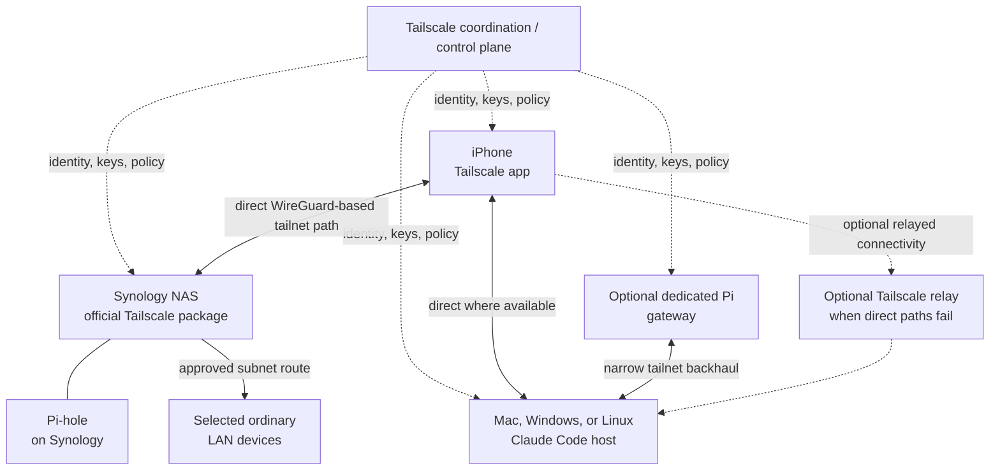
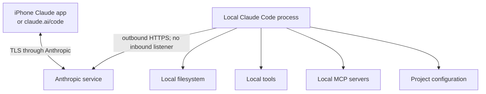
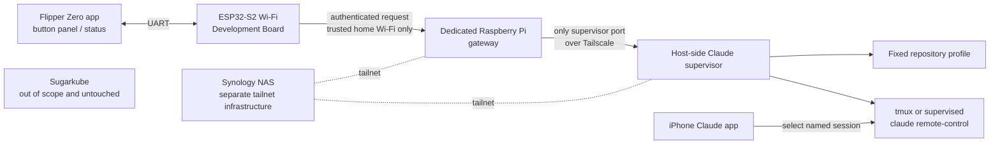

# Remote Claude Code control from iPhone and Flipper

## Status and executive summary

- **Status:** proposed design
- **Last reviewed:** 2026-08-11
- **Implementation state:** documentation only; no deployment or physical Flipper
  integration has been tested.

The recommended sequence is: validate official Claude Code Remote Control first;
build a basic tailnet; add narrowly scoped subnet routing and Pi-hole DNS; optionally
add an exit node; then prototype a local-only Flipper gateway on a dedicated Raspberry
Pi before hardening it. These are separate capabilities:

| Capability | Decision |
| --- | --- |
| Official Claude Code Remote Control | The first milestone and normal phone UI. The local process makes outbound HTTPS connections to Anthropic; it opens no inbound listener and does **not** require Tailscale. |
| Ordinary tailnet access | Private, WireGuard-based node-to-node access to the NAS, Claude host, Pi, and other enrolled devices. It is orthogonal to Remote Control. |
| Subnet routing | Access to selected home-LAN devices that cannot run Tailscale; it does not route general internet traffic. |
| Exit-node routing | Optional routing of the phone's general non-tailnet internet traffic through home; not needed for Remote Control, LAN access, or DNS. |
| Pi-hole DNS | Optional filtered DNS for tailnet clients through the existing Pi-hole, validated before global override. |
| Custom Flipper gateway | A later, local-network-only, low-trust button panel for predefined actions, preferably hosted on a dedicated Pi. |

Use the Synology NAS initially as the always-on Tailscale node, Pi-hole host,
optional subnet router, and optional exit node. Keep Claude Code execution on an
explicitly selected Mac, Windows workstation, or dedicated Linux host. A gateway
must never silently make the NAS an unrestricted execution host. Prefer a dedicated
Pi for a future gateway: standard Linux isolation, updates, logs, and service
supervision are easier to reason about than DSM package and container networking.

The Flipper Zero and stock ESP32-S2 Wi-Fi Development Board are non-tailnet devices;
this design does not assume a supported Tailscale client exists for them. Tailscale
can secure the Pi-to-Claude-host backhaul, but not the Flipper-to-Pi Wi-Fi hop. The
MVP uses no Tailscale Funnel. It exposes no raw shell, arbitrary prompt, repository
path, command argument, Claude credential, or Tailscale credential to the Flipper.
This service, its secrets, and deployment resources remain completely separate from
Sugarkube.

## Goals and non-goals

### Goals

- Control or continue a local Claude Code session from an iPhone.
- Reach selected home services securely while away from home.
- Optionally route DNS through the existing Pi-hole.
- Optionally route general internet traffic through a home exit node.
- Provide a narrowly scoped Flipper control surface later.
- Preserve strong boundaries between personal automation, Sugarkube, and
  unrestricted shell access.
- Make loss or theft of the Flipper low impact.

### Non-goals

- Reimplement Claude Code Remote Control.
- Make Tailscale mandatory for official mobile Remote Control.
- Give the Flipper a general-purpose terminal or accept free-form prompts from it.
- Publicly expose a Claude control API.
- Run this inside Sugarkube.
- Depend on remote connectivity for local safety or host integrity.
- Treat `.local` multicast DNS names as guaranteed across routed networks.

## Terminology

- **Tailnet:** the private network Tailscale creates when devices authenticate into
  the same network. It is not a separate Kubernetes cluster or a manually assembled
  VPN cluster.
- **Tailscale node:** an authenticated device running a supported Tailscale client.
- **MagicDNS:** Tailscale DNS naming for tailnet nodes.
- **Subnet router:** a Tailscale node advertising selected private-network routes on
  behalf of devices that cannot join the tailnet.
- **Exit node:** a node selected by a client to carry general non-tailnet internet
  traffic, similar to a conventional full-tunnel VPN endpoint.
- **Tailscale Serve:** tailnet-only proxying of a local service, commonly with the
  backend bound to loopback.
- **Tailscale Funnel:** public-internet ingress to a service through Tailscale; it is
  deliberately excluded from the MVP.
- **Claude Code Remote Control:** Anthropic's supported facility for connecting the
  Claude app or `claude.ai/code` to a locally running Claude Code process over
  Anthropic's service.
- **Gateway:** the narrow application endpoint that authenticates Flipper requests
  and maps allowlisted actions to supervisor calls.
- **Host-side supervisor:** a restricted service on the chosen Claude execution host
  that validates fixed profiles and manages bounded Claude processes.
- **Flipper app:** purpose-built Flipper Zero UI providing buttons, confirmation, and
  terse status—not a terminal or chat interface.
- **ESP32-S2 Wi-Fi Development Board:** the official Flipper development board that
  provides UART-connected Wi-Fi hardware. Its flash-held application secret is
  considered extractable.

## Official Claude Code phone workflow

Requirements described here are current only as of the review date. Consult the
[official Remote Control documentation](https://code.claude.com/docs/en/remote-control)
at implementation time because account eligibility, plans, minimum versions, and
organization policy can change.

Check the installed version and authenticate:

```sh
claude --version
claude auth login
```

Authentication can instead be performed by starting `claude` and entering `/login`.
Remote Control requires a claude.ai login; API-key-only authentication is not enough.

1. Install the official **Claude by Anthropic** iOS app.
2. Sign into the same account and organization used by Claude Code.
3. Update Claude Code if the installed version predates Remote Control support.
4. Run Claude Code in the project directory at least once and accept workspace trust.
5. Start any supported Remote Control mode:

```sh
# Server mode, suitable for accepting remote sessions
claude remote-control --name "Axel"

# Normal interactive terminal session that is also remotely accessible
claude --remote-control "Axel"
```

From an already running interactive session:

```text
/remote-control Axel
```

Connect by opening the session URL, scanning the displayed QR code, or opening the
iOS app's **Code** tab and selecting the online computer-backed session. The same
conversation can continue from terminal, browser, or phone. `/config` can optionally
enable Remote Control at startup and mobile push notifications.

Operational and privacy boundaries:

- The local `claude` process must remain running. Use `tmux` or `screen` on a
  persistent Linux host if it must survive an SSH disconnect.
- A sleeping or powered-off execution host remains unavailable until it returns.
- Execution and filesystem access remain on that local host.
- While Remote Control is active, session messages, responses, and tool activity are
  synchronized through and stored by Anthropic under its then-current data policy.
- Some terminal-only interactive commands are unavailable from mobile.
- Remote Control uses outbound HTTPS. It needs no inbound firewall rule, listener,
  subnet route, exit node, or Tailscale connection.

The official mobile URL scheme is an optional convenience, not the control protocol:

```text
claude://code
claude://code/{session-id}
claude://code/new
```

A future iOS Shortcut or companion workflow might open these links. The Flipper
cannot be assumed to invoke them directly without explicit phone-side integration.

## Tailnet architecture



The coordination plane distributes identity, keys, and policy; traffic uses direct
WireGuard-based tailnet paths where possible and an optional relay where peer-to-peer
connectivity cannot be established.

### Direct node access

Install Tailscale on the iPhone, Synology NAS, Claude host, and every other directly
managed device. Use stable Tailscale IPs or MagicDNS names. Prefer direct membership
when a supported client can run on the target rather than routing through a subnet
router.

### Subnet router

Discover the actual home LAN CIDR from the current router configuration, advertise
only that necessary CIDR, and approve it in the Tailscale admin console. Never copy an
example CIDR blindly. Use this route only for devices that cannot run Tailscale;
access by stable LAN IP should work when routes, host firewalls, return paths, and
policy are correct.

At implementation time, review Tailscale's current Synology guidance. DSM has hybrid
networking behavior; Tailscale SSH is unavailable on Synology; and sandboxing means
other packages or containers do not necessarily get outbound tailnet connectivity by
default. These limitations must be tested rather than inferred from NAS membership.

`.local` names use multicast DNS and generally do not cross a routed tailnet. Use a
Tailscale IP, MagicDNS name for a tailnet node, stable LAN IP, or ordinary Pi-hole DNS
record for a LAN-only service. In particular, `flipper.local` may work on home Wi-Fi
but is **not** the documented remote-access contract.

### Pi-hole DNS

1. Make the existing Pi-hole reachable by relevant tailnet clients on TCP and UDP
   port 53, through the Synology Tailscale address or an approved LAN route.
2. Add that reachable address as a custom global nameserver in Tailscale DNS settings.
3. Confirm access-control rules permit only the intended DNS traffic.
4. Test resolution before selecting **Override DNS servers**. Enable override only
   after success so a Pi-hole outage does not unexpectedly strand all DNS.
5. Keep MagicDNS enabled for tailnet node names.

Synology Container Manager port publication and the DSM firewall must be validated,
not assumed. From a suitable tailnet client, test both protocol-facing tools:

```sh
dig @<PIHOLE_TAILSCALE_OR_LAN_IP> example.com
nslookup example.com <PIHOLE_TAILSCALE_OR_LAN_IP>
```

iOS normally lacks these command-line tools. Validate there with the Pi-hole query
log and a known blocked test domain, followed by a recovery test with Pi-hole or
Tailscale disabled.

### Optional exit node

A subnet router reaches selected private subnets; an exit node routes general
non-tailnet internet traffic. An exit node is not required for Remote Control, LAN
access, or Pi-hole DNS. The Synology NAS or dedicated Pi may advertise exit-node
routes, which an administrator must approve. The iPhone must explicitly select the
node. **Allow LAN access** controls whether it can still reach its current physical
LAN while the exit node is selected.

Compare the phone's public IP before and after selection and verify intended LAN
behavior. While enabled, the home uplink and exit-node device become availability
dependencies.

## Official Remote Control security boundary



Tailscale is not in this path. The selected local host opens no inbound Remote Control
listener; its Claude process initiates outbound HTTPS and retains local execution,
tools, MCP, configuration, and filesystem authority.

## Flipper gateway architecture



The Flipper is a button panel and terse status display, not the Claude UI. Conversation,
permission review, diffs, and detailed status remain in the official iPhone app. The
Synology is a separate infrastructure node; neither the gateway nor its secrets or
resources belong in Sugarkube.

## Proposed Flipper action protocol

The complete initial allowlist is `status`, `start_session` with fixed `profile_id`,
`stop_session` with a fixed profile or gateway-issued session identifier,
`list_profiles`, and `list_sessions`. The MVP implements only `status` and one
`start_session` profile.

A server-side profile fixes the known repository, checkout path, session name,
permission mode, supervisor unit, maximum concurrent sessions, and allowed execution
host. The Flipper may not supply shell text, a working-directory path, arbitrary Git
URL, branch, free-form prompt, environment variables, permission-bypass flags,
arbitrary process signals, or session IDs not returned by the gateway.

Without implementing a protocol here, a future implementation must provide:

- HTTPS where feasible on the LAN endpoint.
- A per-device application credential in ESP32-S2 storage—never a Claude or Tailscale
  credential—and an assumption that flash secrets are recoverable after theft.
- A short-lived gateway challenge or nonce, monotonic request counter, canonical
  request encoding, and HMAC-SHA-256 or an equivalently reviewed authenticated-request
  mechanism. Do not invent a cryptographic primitive.
- Replay rejection, strict request-size limits, and rate limiting.
- Idempotency keys for start and stop actions.
- An audit log with action, device identity, result, and request ID, but no secrets.
- Explicit physical confirmation on Flipper before state changes, a local gateway kill
  switch, and credential rotation after loss or theft.

## Gateway and host-side supervisor

- Run the gateway as an unprivileged service with no unrestricted general-purpose SSH
  key.
- Restrict `tag:claude-gateway` by Tailscale grants to only the supervisor port.
- Bind the supervisor only to the Tailscale interface, or to localhost behind
  Tailscale Serve. Serve may publish a tailnet-only status/admin UI whose backend is
  loopback-only.
- Tailscale identity headers can supplement authorization for human tailnet clients;
  they do not authenticate the non-tailnet Flipper's LAN request.
- Validate an exact fixed profile and start a bounded service or `tmux` session. Never
  concatenate request values into shell commands; use fixed units or argument arrays.
- Enforce concurrency limits and timeouts. If the selected Claude host is stopped or
  unreachable, return a safe error rather than trying another host.
- Use deterministic session names so the resulting session is easy to find in the app.

Before implementation, confirm how supported Claude Code output exposes session URLs
or IDs. Do not depend on undocumented Anthropic APIs or brittle screen-scraping when
no supported interface exists.

## Placement comparison and recommendation

| Placement | Strengths | Constraints | Decision |
| --- | --- | --- | --- |
| Synology NAS | Already always on; official Tailscale package; already hosts Pi-hole; suitable for subnet and optional exit-node duty. | DSM sandbox/package networking; packages may lack outbound tailnet access by default; no Tailscale SSH; custom-service supervision and debugging are awkward. | Tailnet infrastructure, subnet router, Pi-hole, optional exit node. |
| Dedicated Raspberry Pi | Full Linux and systemd; simple logs/upgrades; clean isolation from NAS and Sugarkube; straightforward Tailscale tags/policy. | Another device to power, patch, back up, and monitor. | Best initial location for a future custom gateway. |
| Claude execution host | Holds repositories, toolchains, credentials, MCP servers, and required compute. | Sleep, reboot, user login, and workspace state affect availability. | Existing explicitly selected development machine; do not migrate execution implicitly. |

The official Claude iOS Remote Control experience remains the normal remote UI.

## Access-control policy

The following is **schematic, non-copy-paste policy**. Placeholder users, groups,
tags, hosts, CIDRs, and ports must be adapted and validated against the current
Tailscale policy syntax. It intentionally grants no gateway-to-LAN rule.

```jsonc
{
  "groups": { "group:owners": ["owner@example.invalid"] },
  "tagOwners": {
    "tag:nas": ["group:owners"],
    "tag:pihole": ["group:owners"],
    "tag:claude-gateway": ["group:owners"],
    "tag:claude-host": ["group:owners"]
  },
  "hosts": { "approved-home-subnet": "<ACTUAL_HOME_CIDR>" },
  "grants": [
    { "src": ["group:owners"], "dst": ["tag:nas"], "ip": ["tcp:<NAS_ADMIN_PORT>"] },
    { "src": ["group:owners"], "dst": ["tag:pihole"], "ip": ["tcp:53", "udp:53"] },
    { "src": ["group:owners"], "dst": ["tag:claude-gateway"], "ip": ["tcp:<STATUS_UI_PORT>"] },
    { "src": ["group:owners"], "dst": ["tag:claude-host"], "ip": ["tcp:<EXPLICIT_ADMIN_PORT>"] },
    { "src": ["group:owners"], "dst": ["approved-home-subnet"], "ip": ["<EXPLICIT_PROTOCOLS_AND_PORTS>"] },
    { "src": ["tag:claude-gateway"], "dst": ["tag:claude-host"], "ip": ["tcp:<SUPERVISOR_PORT>"] }
  ],
  "autoApprovers": {
    "exitNode": ["group:owners"]
  }
}
```

The gateway has only the supervisor edge and cannot reach the rest of the LAN. The
Claude host accepts no arbitrary inbound service; Pi-hole access is TCP/UDP 53 only;
exit-node use is separately authorized; and only administrators own server tags.

Require MFA at the identity provider and device approval. Choose and monitor node-key
expiry; use tagged auth keys for servers, created one-off or injected securely rather
than committed. Consider Tailnet Lock only after understanding signing nodes and
recovery. Immediately revoke lost devices.

## Threat model

| Threat | Mitigations | Residual risk |
| --- | --- | --- |
| Stolen iPhone | Device passcode/biometrics, MFA, device approval, remote wipe, revoke Tailscale node and Claude sessions. | An unlocked phone may expose sessions before revocation. |
| Stolen Flipper or Wi-Fi board | Physical confirmation, narrow credential, kill switch, immediate rotation. | ESP32 secret can be extracted and used until revoked. |
| Extracted ESP32 credential | Per-device credential, counters/nonces, rate limits, rotation; no Claude/Tailscale secrets. | Attacker on reachable LAN can impersonate that device until rotation. |
| Replayed request | Authenticated canonical message, fresh challenge, monotonic counter, short lifetime, idempotency key. | Counter-state loss or bad clock/storage handling can cause rejection or a replay window. |
| Malicious LAN client | Authenticated endpoint, HTTPS where feasible, strict parser, firewall and rate limits. | DoS against the local endpoint remains possible. |
| Compromised gateway | Unprivileged isolated service, no shell key, single-port grant, fixed profiles. | It may start allowed profiles or attack supervisor parsing. |
| Compromised Claude host | Host hardening, least privilege, bounded Claude permissions, credential hygiene. | Local repositories, tools, and credentials are in the host's trust boundary. |
| Compromised Tailscale account | IdP MFA, device approval, narrow grants, alerts, optional Tailnet Lock. | Administrator compromise can alter policy or admit nodes. |
| Overly broad grants | Deny by omission, explicit ports, policy review and negative connectivity tests. | Policy mistakes may expose services until detected. |
| Accidental Tailscale Funnel exposure | No Funnel in MVP; inspect Serve/Funnel status; disable Funnel; separate threat model for any future use. | Human error could create public ingress. |
| DNS outage | Test before override, retain recovery steps, monitor Pi-hole, disable override when unavailable. | With override active, name resolution can fail. |
| Exit-node outage | Optional explicit selection, recovery instructions, monitoring. | Internet connectivity degrades until phone deselects it. |
| Host sleep or reboot | Persistent awake host where required, supervisor restart policy, clear unavailable status. | Sessions and unsaved state may be lost. |
| Stale Remote Control session | Stop local process, timeouts, session inventory, sign out/revoke when suspicious. | Anthropic-retained synchronized data follows its policy. |
| Command injection | Fixed profiles/units or argument arrays, strict schemas, no free-form fields. | Bugs in supervisor or invoked tools remain possible. |
| Unrestricted Claude permissions | Fixed conservative permission mode and review in official app; never pass bypass flags. | Approved tools can still have significant local authority. |
| Session-start flood | Rate and concurrency limits, idempotency, cooldown, bounded units. | Allowed capacity can still be consumed temporarily. |
| Secrets appearing in logs | Structured allowlisted fields, redaction, restricted retention/access; never log bodies or credentials. | Dependency or operator logs may still leak metadata. |
| Physical attacker pressing Flipper buttons | Confirmation gesture, device credential, limited actions, session limits, kill switch. | Attacker holding an unlocked device can trigger the narrow allowlist. |

## Failure and revocation runbook

1. **Lost iPhone:** remove the node in the Tailscale admin console, revoke Claude
   account sessions using current Anthropic account controls, remotely lock/wipe the
   phone, and review both services' activity.
2. **Gateway or Claude host:** remove/expire the node, revoke its tagged auth key if
   reusable, remove its routes/tags, and rotate any application credential it held.
3. **Flipper/board:** disable its device ID, stop the listener if uncertain, issue a new
   per-device credential through a secure local procedure, reset counter state safely,
   and test rejection of the old credential.
4. **LAN gateway listener:** stop and disable its supervised unit and block its LAN
   port at the Pi host firewall.
5. **Serve or Funnel:** inspect current Tailscale service status and turn off the
   published service; verify from both tailnet and public networks. Funnel should
   already be absent.
6. **Subnet route:** disable advertising on the router and disable/remove approval in
   the admin console; verify the LAN IP is unreachable remotely.
7. **Exit node:** deselect it on iPhone, then disable its advertised/approved exit
   routes; verify normal public IP and DNS recover.
8. **Claude sessions:** stop the fixed supervisor unit or named `tmux` session and
   confirm the process is gone.
9. **Remote Control:** exit `/remote-control` or terminate the local `claude` process;
   disable startup Remote Control in `/config`; confirm the app shows it offline.
10. **Logs:** query by request ID and review action/device/result metadata with
    least-privilege access; do not export prompts, request bodies, repository content,
    credentials, or environment values.

## Phased implementation plan

### Phase A: official mobile Remote Control

- Update Claude Code and sign in through claude.ai.
- Start a named Remote Control session and connect from iPhone over cellular.
- Approve a harmless read-only action; confirm local repository/tools remain usable.
- Verify the host opens no inbound port and record session termination behavior.

### Phase B: basic tailnet

- Add iPhone, Synology NAS, and Claude host; enable MagicDNS.
- Verify direct device access, create least-privilege policy, and enable device approval.

### Phase C: home LAN and Pi-hole

- Discover, advertise, and approve the correct home subnet; verify by LAN IP.
- Record that `flipper.local` is not the remote contract.
- Configure Pi-hole as tailnet DNS and test before enabling DNS override.

### Phase D: optional exit node

- Advertise and approve the route, explicitly select it on iPhone, and verify public IP.
- Verify **Allow LAN access** behavior and document recovery when unavailable.

### Phase E: local-only Flipper proof of concept

- Use a dedicated Pi, one fixed profile, and only `status` plus one `start_session`.
- Allow no free-form fields; test invalid signatures and replays.
- Perform a lost-device credential-rotation drill.

### Phase F: hardened gateway

- Add the host-side supervisor, strict grants, rate limits, safe audit log, and service
  isolation.
- Validate backup/restore and inject gateway, host, DNS, and network failures.

### Deferred remote-Flipper options

Truly remote use requires a companion device that can join the tailnet, a deliberately
designed phone relay, or separately threat-modeled public ingress. Tailscale Funnel is
not the default and remains excluded from the MVP.

## Validation matrix

| Check | Pass condition |
| --- | --- |
| Named session over cellular | Official Claude iOS app sees and opens the named local session with Wi-Fi off. |
| Local capabilities | The session accesses only the selected local repository and expected tools. |
| Process termination | Stopping local `claude` makes Remote Control unavailable. |
| No inbound listener | Before/after socket and firewall inspection shows no new inbound Remote Control port. |
| MagicDNS | Tailnet node names resolve to expected Tailscale addresses. |
| Subnet route | One explicitly approved LAN IP is reachable; an unapproved destination is not. |
| `.local` independence | Every remote procedure uses Tailscale/MagicDNS, stable LAN IP, or normal DNS—never `flipper.local`. |
| Pi-hole from phone | Query log records the iPhone and a known blocked test domain is blocked. |
| DNS recovery | Disabling Pi-hole or Tailscale and following the runbook restores resolution. |
| Exit node | Observed iPhone public IP changes when selected and returns when deselected. |
| Unauthorized tailnet device | Negative tests to NAS, DNS, gateway, host, and LAN are denied. |
| Gateway isolation | Gateway reaches the supervisor port but no unrelated LAN destination. |
| Parser/authentication | Malformed, oversized, unsigned, stale, duplicate, and replayed requests are rejected. |
| No arbitrary control | Schemas cannot represent shell text, paths, permission flags, or free-form prompts. |
| Low-impact loss | Losing Flipper requires rotation only of its narrow application credential. |
| Sugarkube separation | Its repository, cluster, secrets, manifests, and deployment resources remain untouched. |

## Open questions

- Which machine should remain awake to run Claude Code?
- Should the dedicated Pi run only the gateway, or also a Claude supervisor and
  repository worktrees?
- What is the actual home LAN CIDR?
- Can Pi-hole's Container Manager networking accept DNS through the Synology Tailscale
  address without additional DSM configuration?
- Which actions are valuable enough to justify a Flipper button?
- Is `start_session` enough, with all interaction continuing in the official app?
- What security property would justify remote Flipper ingress beyond the home LAN?
- Is a phone Shortcut a better remote physical-control bridge than public ingress?
- What logs and metrics help without retaining prompts, repository contents, or secrets?
- What supported Claude Code interface, if any, exposes new session URLs or IDs?

## Authoritative references

Requirements in these external sources are volatile; all were last reviewed for this
design on **2026-08-11** and must be reconfirmed during implementation.

- [Claude Code Remote Control](https://code.claude.com/docs/en/remote-control)
- [Install Claude for iOS](https://support.claude.com/en/articles/9266462-install-claude-for-ios)
- [Open the Claude mobile app with a link](https://support.claude.com/en/articles/14898120-open-the-claude-mobile-app-with-a-link)
- [Tailscale on Synology](https://tailscale.com/docs/integrations/synology)
- [Subnet routers](https://tailscale.com/docs/features/subnet-routers)
- [Set up an exit node](https://tailscale.com/docs/features/exit-nodes/how-to/setup)
- [MagicDNS](https://tailscale.com/docs/features/magicdns)
- [DNS in Tailscale](https://tailscale.com/docs/reference/dns-in-tailscale)
- [Pi-hole with Tailscale](https://tailscale.com/docs/solutions/block-ads-all-devices-anywhere-using-raspberry-pi)
- [Tailscale Serve](https://tailscale.com/docs/features/tailscale-serve)
- [Tailscale Funnel](https://tailscale.com/docs/features/tailscale-funnel)
- [Device approval](https://tailscale.com/docs/features/access-control/device-management/device-approval)
- [Tailscale security best practices](https://tailscale.com/docs/reference/best-practices/security)
- [Tailnet Lock](https://tailscale.com/docs/features/tailnet-lock)
- [Flipper Zero Wi-Fi Development Board](https://developer.flipper.net/flipperzero/doxygen/dev_board.html)
