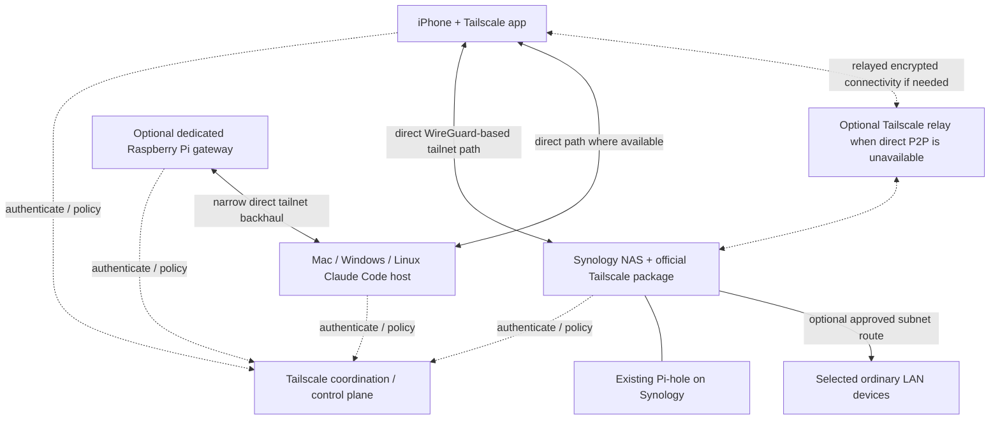
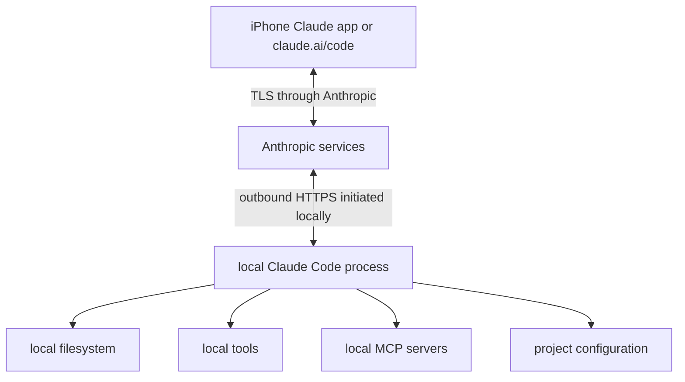
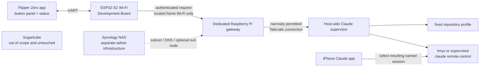

# Remote Claude Code control from an iPhone and constrained hardware

## Status and executive summary

- **Status:** proposed design
- **Last reviewed:** 2026-08-11
- **Implementation status:** documentation only; no deployment or physical Flipper integration has been tested.

The first and recommended milestone is the official Claude Code Remote Control workflow. It lets the official Claude iPhone app continue a Claude Code process running on a deliberately selected Mac, Windows workstation, or Linux host. The local process makes outbound HTTPS connections to Anthropic; it opens no inbound Remote Control port and **does not require Tailscale**.

Build the personal Tailscale tailnet separately: first add the iPhone, Synology NAS, and Claude host; then, if needed, add narrowly advertised LAN routes, Pi-hole DNS, and an opt-in exit node. Only after those layers work independently should a local-only Flipper prototype be considered. A hardened gateway is last.

| Capability | Decision and boundary |
| --- | --- |
| Official Claude Code Remote Control | Normal phone UI and first milestone. TLS synchronization goes through Anthropic, not Tailscale. |
| Ordinary tailnet access | Direct, private access between authenticated Tailscale nodes such as the iPhone, NAS, Pi, and Claude host. |
| Subnet routing | Optional access to specifically advertised home-LAN CIDRs for devices that cannot join the tailnet. It does not route the general internet. |
| Exit-node routing | Separately approved and explicitly selected routing of general non-tailnet internet traffic through a home node. |
| Pi-hole DNS | Optional global tailnet nameserver after reachability and failure recovery have been tested; retain MagicDNS for node names. |
| Custom Flipper gateway | Later, local-LAN-only, low-trust button interface to fixed actions. A dedicated Raspberry Pi is preferred; no public Funnel in the MVP. |

The Synology NAS is initially the always-on Tailscale node, optional subnet router, existing Pi-hole host, and optional exit node. Prefer a dedicated Raspberry Pi for future gateway code because conventional Linux isolation, updates, logs, and service supervision are easier to reason about than DSM package and container networking. Keep execution on an explicitly chosen Claude host. Neither the gateway nor this design silently turns the NAS into an unrestricted execution host.

The Flipper Zero and stock ESP32-S2 Wi-Fi Development Board are treated as **non-tailnet, low-trust devices**; this design does not assume a supported Tailscale client exists for them. Tailscale can protect gateway-to-host backhaul but cannot protect the Flipper-to-gateway Wi-Fi hop unless that device itself joins the tailnet. The service, its secrets, and deployment resources remain completely separate from Sugarkube.

## Goals and non-goals

### Goals

- Control or continue a local Claude Code session from an iPhone.
- Reach selected home services securely while away from home.
- Optionally route DNS through the existing Pi-hole.
- Optionally route general internet traffic through a home exit node.
- Provide a narrowly scoped Flipper control surface later.
- Preserve strong boundaries between personal automation, Sugarkube, and unrestricted shell access.
- Make loss or theft of the Flipper low impact.

### Non-goals

- Reimplement Claude Code Remote Control.
- Make Tailscale mandatory for official mobile Remote Control.
- Give the Flipper a general-purpose terminal or accept free-form prompts from it.
- Publicly expose a Claude control API.
- Run this inside Sugarkube.
- Depend on remote connectivity for local safety or host integrity.
- Treat `.local` multicast DNS names as guaranteed across routed networks.

## Terminology

- **Tailnet:** the private network Tailscale creates when devices authenticate into the same network. It is not a separate Kubernetes cluster or a manually assembled VPN cluster.
- **Tailscale node:** an authenticated device running a supported Tailscale client.
- **MagicDNS:** Tailscale DNS naming for tailnet nodes.
- **Subnet router:** a tailnet node advertising selected non-tailnet IP subnets to authorized peers.
- **Exit node:** a node that can route a client's general non-tailnet internet traffic, when separately authorized and selected.
- **Tailscale Serve:** tailnet-only proxying of a local service, commonly with the backend bound to loopback.
- **Tailscale Funnel:** public internet ingress to a service through Tailscale. It is deliberately excluded from the MVP.
- **Claude Code Remote Control:** Anthropic's supported facility for connecting claude.ai/code or the Claude mobile app to a locally running Claude Code process.
- **Gateway:** the future dedicated Pi service that authenticates and translates a tiny Flipper action protocol into supervisor requests.
- **Host-side supervisor:** a bounded service on the Claude execution host that validates fixed profiles and manages approved sessions.
- **Flipper app:** a proposed Flipper Zero UI that acts only as a button panel and status display.
- **ESP32-S2 Wi-Fi Development Board:** the stock Flipper development board connected over UART and used for the prototype's local Wi-Fi requests; it is not assumed to be a Tailscale node.

## Official Claude Code phone workflow

Requirements below reflect the official documentation as reviewed on 2026-08-11. Account eligibility, plans, minimum versions, commands, and organization policy are volatile; confirm them in the [current Remote Control documentation](https://code.claude.com/docs/en/remote-control) at implementation time.

Check the installed client and authenticate:

```sh
claude --version
claude auth login
```

Authentication can instead be performed by starting `claude` and using `/login`. Remote Control requires a claude.ai login; API-key-only authentication is insufficient.

1. Install the official [Claude by Anthropic iOS app](https://support.claude.com/en/articles/9266462-install-claude-for-ios).
2. Sign into the same account and organization used by Claude Code.
3. Update Claude Code if the installed version predates Remote Control support.
4. Run Claude Code in the project directory at least once and accept workspace trust.
5. Start one of the supported modes:

```sh
# Server mode, suitable for accepting remote sessions
claude remote-control --name "Axel"

# Normal interactive terminal session that is also remotely accessible
claude --remote-control "Axel"
```

From an already running interactive session:

```text
/remote-control Axel
```

Connect by opening the displayed session URL or scanning its QR code. Alternatively, open the iOS app, select **Code**, and choose the online computer-backed session. The same conversation can continue from terminal, browser, or phone. `/config` can optionally enable Remote Control at startup and mobile push notifications.

Operational and privacy limitations:

- The local `claude` process must remain running. Use `tmux` or `screen` on a persistent Linux host when it must survive SSH disconnection.
- A sleeping or powered-off host is unavailable until it returns.
- Filesystem access, tool execution, MCP servers, and project configuration remain on the local host.
- While Remote Control is active, messages, responses, and tool activity are synchronized through and stored by Anthropic, subject to Anthropic's current data policy.
- Some terminal-only interactive commands are unavailable from mobile.
- Remote Control uses outbound HTTPS; it neither needs Tailscale nor an inbound firewall rule.

The [official mobile link scheme](https://support.claude.com/en/articles/14898120-open-the-claude-mobile-app-with-a-link) is an optional convenience, not the control mechanism:

```text
claude://code
claude://code/{session-id}
claude://code/new
```

A future iOS Shortcut or companion workflow might open these links. This design does not claim the Flipper can invoke them directly without a phone-side integration.

## Tailnet architecture



The control plane coordinates identity, keys, and policy; encrypted data paths are direct where possible and may be relayed when peer-to-peer connectivity is unavailable.

### Direct node access

Install Tailscale on the iPhone, Synology NAS, Claude host, and every other directly managed supported device. Use stable Tailscale IPs or MagicDNS names. Prefer direct node membership over subnet routing whenever the target can run Tailscale itself.

### Subnet router

Discover the actual home LAN CIDR from the current router configuration, advertise only that required CIDR, and approve it in the Tailscale admin console. Never copy an example CIDR blindly. Use this route only for LAN devices that cannot run Tailscale; access by LAN IP should work when route approval and policy are correct.

Review the [current Synology integration limitations](https://tailscale.com/docs/integrations/synology) before configuration. DSM has hybrid-networking behavior; Tailscale SSH is unavailable on Synology; and DSM sandbox/package or Container Manager networking can prevent other packages from making outbound tailnet connections without additional configuration. Do not assume a package can use the NAS's tailnet connectivity.

`.local` names normally use multicast DNS, which generally does not cross a routed tailnet. Use a Tailscale IP, MagicDNS name for a tailnet node, stable LAN IP, or normal Pi-hole DNS record for a LAN-only service. `flipper.local` may work on home Wi-Fi, but it is **not** the documented remote-access contract.

### Pi-hole DNS

1. Make Pi-hole reachable by relevant Tailscale clients on both TCP and UDP port 53. Validate Synology Container Manager port publishing and the DSM firewall rather than assuming either is correct.
2. Add its reachable Tailscale or routed LAN address as a custom global nameserver in Tailscale DNS settings.
3. Permit only the required DNS traffic in access-control rules.
4. Test directly before enabling **Override DNS servers**:

   ```sh
   dig @<PIHOLE_TAILSCALE_OR_LAN_IP> example.com
   nslookup example.com <PIHOLE_TAILSCALE_OR_LAN_IP>
   ```

5. Enable override only after successful validation so an initial configuration error does not strand all name resolution. Document how to disable override during a Pi-hole outage.
6. Keep MagicDNS enabled for tailnet node names.

On iOS, where command-line DNS tools are not normally present, validate using the Pi-hole query log and a known blocked test domain, then confirm ordinary and MagicDNS resolution. Follow Tailscale's current [DNS](https://tailscale.com/docs/reference/dns-in-tailscale) and [Pi-hole](https://tailscale.com/docs/solutions/block-ads-all-devices-anywhere-using-raspberry-pi) guidance.

### Optional exit node

A subnet router exposes selected private subnets; an exit node routes general non-tailnet internet traffic. The exit node is not required for Remote Control, LAN access, or Pi-hole DNS.

The NAS or dedicated Pi may advertise exit-node capability. An administrator must approve it, exit-node use must be separately authorized, and the iPhone must explicitly select it. **Allow LAN access** determines whether the phone can still reach its current physical LAN while the exit node is selected. Compare the iPhone's observed public IP with and without the exit node and test the LAN-access setting. While enabled, the selected node and home uplink become availability dependencies. Consult the [current exit-node setup](https://tailscale.com/docs/features/exit-nodes/how-to/setup).

## Official Remote Control security boundary



Tailscale is not in this path. The local Claude Code process initiates outbound HTTPS and opens no inbound Remote Control listener. Anthropic account controls and Claude permissions protect this boundary; tailnet policy does not replace them.

## Flipper gateway architecture



The first prototype is local-network-only. The Flipper-to-gateway hop is not protected by Tailscale; only the Pi-to-Claude-host backhaul may be. The Flipper is a button panel and status display, not the Claude UI. Conversation, permission review, diffs, and detailed status remain in the official iPhone app. The NAS remains separate infrastructure, and no component belongs in Sugarkube.

## Proposed Flipper action protocol

The eventual allowlist is `status`, `start_session` with a fixed `profile_id`, `stop_session` with a fixed profile or gateway-returned session identifier, `list_profiles`, and `list_sessions`. The MVP exposes only `status` and one `start_session` profile.

A server-side profile fixes the known repository and checkout path, session name, permission mode, supervisor unit, maximum concurrent sessions, and allowed execution host. The Flipper must never supply shell text, a working-directory path, arbitrary Git URL, branch name, free-form prompt, environment variable, permission-bypass flag, arbitrary process signal, or arbitrary session ID not returned by the gateway. It receives no Claude or Tailscale credentials.

Without implementing a protocol here, require:

- HTTPS where feasible on the LAN endpoint.
- A per-device application credential on the ESP32-S2, treating flash secrets as recoverable after theft.
- A short-lived gateway challenge or nonce, monotonic request counter, canonical request encoding, and HMAC-SHA-256 (or an equivalently reviewed authenticated-request mechanism). Do not invent cryptography.
- Replay rejection, strict request-size limits, rate limiting, and idempotency keys for start/stop.
- An audit record of action, device identity, result, and request ID, but no credential, prompt, repository content, or other secret.
- Explicit physical confirmation before state-changing actions, a local gateway kill switch, and credential rotation after loss or theft.

## Gateway and host-side supervisor

- Run the gateway unprivileged, without a general-purpose SSH key or unrestricted shell access.
- Restrict `tag:claude-gateway` with Tailscale grants to the supervisor port only; it cannot reach the rest of the LAN.
- Bind the supervisor only to the Tailscale interface, or to loopback behind [Tailscale Serve](https://tailscale.com/docs/features/tailscale-serve). Serve may expose a tailnet-only administration/status UI with a loopback backend.
- Tailscale identity headers may supplement authorization for human tailnet clients. They do **not** authenticate the non-tailnet Flipper LAN request.
- Validate only fixed profiles and start bounded service units or `tmux` sessions. Never concatenate user-controlled strings into shell commands; use fixed units or argument arrays.
- Enforce concurrent-session limits and timeouts. If the selected Claude host is stopped or unreachable, return a safe error rather than trying another host.
- Use deterministic session names so the intended session is easy to find in the Claude app.

Before implementation, confirm how supported Claude Code output exposes session URLs or IDs. Do not depend on undocumented Anthropic APIs or brittle terminal screen-scraping if no supported interface is available.

## Placement comparison and recommendation

| Placement | Strengths | Constraints | Decision |
| --- | --- | --- | --- |
| Synology NAS | Already always on; official Tailscale package; already hosts Pi-hole; suitable subnet router and optional exit node. | DSM sandbox and package networking; other packages cannot necessarily make outbound tailnet connections by default; no Tailscale SSH; custom-service supervision and debugging are awkward. | Tailscale infrastructure, Pi-hole, optional subnet route and exit node. Not the gateway or implicit Claude host. |
| Dedicated Raspberry Pi | Full Linux; systemd; simple logs and upgrades; clean isolation from NAS and Sugarkube; straightforward policy/tagging. | Another device to power, patch, back up, and monitor. | Best initial location for the future gateway. |
| Claude execution host | Has repositories, toolchains, credentials, MCP servers, and compute Claude Code needs. | Sleep, reboot, user login, and workspace state affect availability. | Existing selected development machine (or explicitly dedicated Linux machine) runs Claude Code. |

Thus the official Claude iOS Remote Control is the normal remote UI; Synology provides tailnet infrastructure; a dedicated Pi hosts a future gateway; and the development host executes Claude Code.

## Access-control policy

The following is **schematic, non-copy-paste policy**. Placeholder identities, tags, host aliases, ports, route CIDRs, and the current Tailscale policy schema must be adapted and validated before use.

```jsonc
{
  "tagOwners": {
    "tag:synology": ["admin@example.invalid"],
    "tag:claude-gateway": ["admin@example.invalid"],
    "tag:claude-host": ["admin@example.invalid"]
  },
  "groups": {
    "group:owners": ["owner@example.invalid"]
  },
  "hosts": {
    "pihole": "<PIHOLE_TAILSCALE_OR_LAN_IP>",
    "gateway": "<GATEWAY_TAILSCALE_IP>",
    "claude-host": "<CLAUDE_HOST_TAILSCALE_IP>",
    "approved-home-subnet": "<ACTUAL_HOME_CIDR>"
  },
  "grants": [
    {"src": ["group:owners"], "dst": ["tag:synology"], "ip": ["tcp:<ADMIN_PORTS>"]},
    {"src": ["group:owners"], "dst": ["pihole"], "ip": ["udp:53", "tcp:53"]},
    {"src": ["group:owners"], "dst": ["gateway"], "ip": ["tcp:<STATUS_UI_PORT>"]},
    {"src": ["group:owners"], "dst": ["claude-host"], "ip": ["tcp:<EXPLICIT_ADMIN_PORT>"]},
    {"src": ["group:owners"], "dst": ["approved-home-subnet"], "ip": ["tcp:<APPROVED_LAN_PORTS>"]},
    {"src": ["tag:claude-gateway"], "dst": ["tag:claude-host"], "ip": ["tcp:<SUPERVISOR_PORT>"]}
  ]
  // Add current-schema exit-node authorization separately; do not infer it
  // from LAN or supervisor access. No grant gives the gateway general LAN access.
}
```

The Claude host exposes no arbitrary inbound services. DNS is limited to TCP/UDP 53, the gateway can reach only the supervisor port, and exit-node use is independently authorized.

Require identity-provider MFA, device approval, and immediate revocation of lost devices. Choose node-key expiry deliberately. Use tagged server auth keys that are one-off or securely injected, never committed. Server tags are administrator-owned only. Consider Tailnet Lock only after understanding its signing-node and recovery requirements; losing required signing/recovery material can create its own outage.

## Threat model

| Threat | Mitigations | Residual risk |
| --- | --- | --- |
| Stolen iPhone | Strong passcode/biometrics, OS updates, account MFA, device approval, remote lock/wipe, revoke Tailscale node and Claude sessions. | Unlocked phone may expose active sessions before revocation. |
| Stolen Flipper or Wi-Fi board | Narrow per-device credential, physical confirmation, no Claude/Tailscale secrets, kill switch, prompt rotation drill. | ESP32 credential should be assumed extractable. |
| Extracted ESP32 credential | Unique credential, nonce/counter, rate limits, revoke and rotate only that identity. | Attacker can impersonate the device until detection/revocation. |
| Replayed request | Short-lived challenge, monotonic counter, idempotency key, timestamp window, replay cache. | State loss or clock/counter recovery errors need fail-closed handling. |
| Malicious LAN client | Authenticate every request, HTTPS where feasible, strict parser and sizes, network segmentation/rate limits. | LAN denial of service remains possible. |
| Compromised gateway | Unprivileged isolated service, minimal secrets, narrow tailnet grant, no SSH key, patched OS. | It can invoke allowed supervisor actions until revoked. |
| Compromised Claude host | Least Claude permissions, host hardening, scoped credentials, repository boundaries, audit session starts. | Local tools and accessible repositories may be compromised. |
| Compromised Tailscale account | IdP MFA, device approval, alerts/review, admin separation, optional understood Tailnet Lock. | Account recovery and trusted endpoints remain critical. |
| Overly broad grants | Default deny, narrow ports/tags, policy tests and peer review. | Policy mistakes can expose unintended services. |
| Accidental Funnel exposure | No Funnel in MVP; inventory public endpoints; disable it in runbook; separate future threat model. | Misconfiguration could create public ingress until detected. |
| DNS outage | Test before override, retain recovery instructions, monitor Pi-hole, disable override/fallback deliberately. | Name resolution may fail while override points to an unavailable server. |
| Exit-node outage | Exit node is optional and explicitly selected; document deselection. | Internet access fails or degrades until the phone switches routes. |
| Host sleep or reboot | Persistent selected host, power policy, supervised restart only where intended, safe unavailable response. | Sessions remain unavailable during host downtime. |
| Stale Remote Control session | Stop unused processes, timeouts, named-session inventory, revoke account sessions when needed. | Synced history remains subject to Anthropic retention policy. |
| Command injection | Fixed profiles/units, argument arrays, schema validation, no free-form fields. | Bugs in supervisor or called tools remain possible. |
| Unrestricted Claude permissions | Fixed conservative permission mode and human review in the official app; no bypass flags. | Approved tools can still have significant local effects. |
| Session-start flood | One MVP profile, concurrency cap, rate limits, idempotency, timeouts. | Allowed sessions can still consume bounded resources. |
| Secrets in logs | Structured allowlisted metadata, redaction, access control, retention limit; never log bodies/credentials. | Downstream tools might independently log sensitive data. |
| Physical attacker pressing buttons | Confirmation gesture, locked/off switch, narrow actions, local-network requirement. | An unlocked device on home Wi-Fi can request allowed bounded actions. |

## Failure and revocation runbook

- **Lost iPhone:** remove/expire the device in Tailscale administration; revoke Claude account sessions through current account controls; change account credentials if indicated; remotely lock or wipe; review both audit trails.
- **Gateway or Claude host:** disable/remove its Tailscale node and revoke its tagged auth key; disable the relevant grants; stop the service locally; rotate any host-specific credential.
- **Flipper credential:** disable the device identity at the gateway, rotate the unique application credential, clear replay state safely, provision the replacement out of band, and test that the old credential fails.
- **LAN listener:** activate the local kill switch, stop/disable the gateway unit, and block its listening port at the Pi firewall or access point.
- **Serve or Funnel:** run the current Tailscale command to disable the configured Serve/Funnel endpoint and confirm the admin console shows no public ingress. Funnel should already be absent.
- **Subnet route:** disable route advertisement on the router and/or approval in the admin console; verify the LAN CIDR is no longer reachable remotely.
- **Exit node:** deselect it on the iPhone, then disable its advertisement or admin approval; confirm ordinary internet access and public IP recover.
- **Supervised sessions:** invoke only the fixed stop unit/profile locally, confirm its `claude` and `tmux` processes ended, and preserve a redacted audit event.
- **Remote Control:** stop the local `claude` process or use its supported command to disable Remote Control; verify the named session is offline in the app and review Claude account sessions if compromise is suspected.
- **Logs:** restrict access, query by request/device ID, redact before export, and avoid printing request authentication, prompts, repository contents, session URLs, environment, or credentials.

## Phased implementation plan

### Phase A: official mobile Remote Control

- Update Claude Code and sign in through claude.ai.
- Start a named session, connect from iPhone over cellular, and approve a harmless read-only action.
- Verify local repository/tools remain available, the host opens no inbound port, and stopping the process ends Remote Control.

### Phase B: basic tailnet

- Add iPhone, Synology NAS, and Claude host; enable MagicDNS.
- Verify direct device access, create least-privilege policy, and enable device approval.

### Phase C: home LAN and Pi-hole

- Discover, advertise, and approve the correct home subnet; verify access by LAN IP.
- Record that `flipper.local` is not the remote contract.
- Configure Pi-hole as tailnet DNS, test direct DNS and outage recovery, then enable override if desired.

### Phase D: optional exit node

- Advertise and approve the node, explicitly select it on iPhone, and verify the public IP.
- Test Allow LAN access and document deselection/recovery when the node is unavailable.

### Phase E: local-only Flipper proof of concept

- Use a dedicated Pi gateway and one fixed profile with only `status` and `start_session`.
- Permit no free-form fields; test invalid signatures and replay rejection; drill lost-device credential rotation.

### Phase F: hardened gateway

- Add the host-side supervisor, strict grants, rate limits, redacted audit log, and service isolation.
- Test backup/restore and inject host, DNS, gateway, and network failures.

### Deferred remote-Flipper options

Truly remote Flipper use requires a companion device that can join the tailnet, a deliberately designed phone relay, or separately threat-modeled public ingress. Funnel is not the default and is excluded from the MVP because it creates a public attack surface.

## Validation matrix

| Check | Measurable expected result |
| --- | --- |
| Official mobile connection | Over cellular, the iOS Code tab sees and opens the named local session. |
| Local capabilities | A harmless read-only request can access the selected repository and expected local tools. |
| Process lifecycle | Stopping local `claude` makes the Remote Control session unavailable. |
| No inbound listener | Before/after socket inventory shows no new inbound Remote Control port; only outbound HTTPS appears. |
| MagicDNS | iPhone resolves and reaches approved tailnet node names. |
| Subnet route | One approved LAN IP is reachable; an unapproved subnet is not. |
| No `.local` dependency | All remote procedures use Tailscale/MagicDNS/stable LAN/DNS records, never `flipper.local`. |
| Pi-hole | Phone queries appear in Pi-hole logs and a known blocked test resolves as expected. |
| DNS recovery | Disabling Pi-hole or Tailscale and following the recovery procedure restores resolution. |
| Exit node | Observed public IP changes when selected and returns when deselected. |
| Tailnet denial | An unauthorized test identity cannot reach protected NAS, DNS, gateway, supervisor, or LAN ports. |
| Gateway isolation | Gateway reaches the supervisor port but cannot reach unrelated LAN destinations. |
| Protocol rejection | Malformed, oversized, unsigned, stale, duplicate, and replayed requests all fail closed. |
| Input boundary | Schema tests prove Flipper cannot submit shell text, paths, environment, flags, or arbitrary prompts. |
| Lost Flipper | Revoking/rotating only its narrow application credential blocks it; no Claude/Tailscale credential rotates. |
| Sugarkube separation | Its repositories, cluster, secrets, manifests, and services have no changes or dependencies. |

## Open questions

- Which machine should remain awake to run Claude Code?
- Should the dedicated Pi run only the gateway, or also a Claude supervisor and repository worktrees?
- What is the actual home LAN CIDR?
- Can Pi-hole's Container Manager networking accept DNS queries through the Synology Tailscale address without additional DSM configuration?
- Which actions are valuable enough to justify a Flipper button?
- Is `start_session` enough, with all interaction continuing in the official Claude app?
- What security property would justify remote Flipper ingress beyond the home LAN?
- Is a phone Shortcut a better remote physical-control bridge than public gateway ingress?
- What logs and metrics are useful without retaining prompts, repository contents, or secrets?
- What supported Claude Code output provides session URLs or IDs, and is it stable enough for a supervisor?

## Authoritative references

These volatile sources were last reviewed on 2026-08-11; re-check them at implementation time rather than treating versions, eligibility, syntax, DSM behavior, or policy schema as timeless.

- [Claude Code Remote Control](https://code.claude.com/docs/en/remote-control)
- [Install Claude for iOS](https://support.claude.com/en/articles/9266462-install-claude-for-ios)
- [Open the Claude mobile app with a link](https://support.claude.com/en/articles/14898120-open-the-claude-mobile-app-with-a-link)
- [Tailscale on Synology](https://tailscale.com/docs/integrations/synology)
- [Tailscale subnet routers](https://tailscale.com/docs/features/subnet-routers)
- [Set up an exit node](https://tailscale.com/docs/features/exit-nodes/how-to/setup)
- [MagicDNS](https://tailscale.com/docs/features/magicdns)
- [DNS in Tailscale](https://tailscale.com/docs/reference/dns-in-tailscale)
- [Pi-hole for tailnet clients](https://tailscale.com/docs/solutions/block-ads-all-devices-anywhere-using-raspberry-pi)
- [Tailscale Serve](https://tailscale.com/docs/features/tailscale-serve)
- [Tailscale Funnel](https://tailscale.com/docs/features/tailscale-funnel)
- [Device approval](https://tailscale.com/docs/features/access-control/device-management/device-approval)
- [Tailscale security best practices](https://tailscale.com/docs/reference/best-practices/security)
- [Tailnet Lock](https://tailscale.com/docs/features/tailnet-lock)
- [Flipper Zero Wi-Fi Development Board](https://developer.flipper.net/flipperzero/doxygen/dev_board.html)
