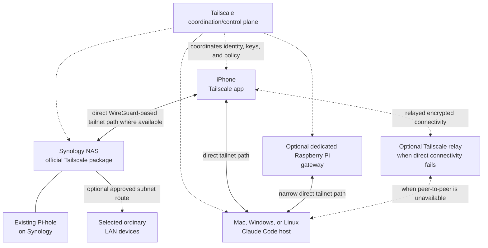
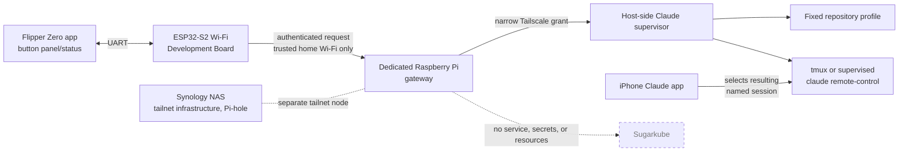

# Remote Claude Code control from iPhone and Flipper Zero

## Status and executive summary

- **Status:** proposed design
- **Last reviewed:** 2026-08-11
- **Implementation state:** documentation only; no deployment or physical Flipper integration has
  been tested.

The recommended sequence is: prove the official Claude Code Remote Control workflow first; build
basic direct tailnet access; add a narrowly advertised home subnet and Pi-hole DNS; optionally add
an exit node; then prototype a local-network-only Flipper gateway on a dedicated Raspberry Pi and
harden it only after the earlier boundaries have been validated.

The decisions are deliberately separated:

| Capability | Decision |
| --- | --- |
| Official Claude Code Remote Control | Recommended first milestone and normal remote user interface. The local process connects outbound to Anthropic over HTTPS; **it does not require Tailscale or open an inbound port**. |
| Ordinary tailnet access | An orthogonal private-network layer for directly enrolled devices such as the iPhone, NAS, Pi, and Claude host. |
| Subnet routing | Optional access to explicitly selected home-LAN devices that cannot run Tailscale; it is not general internet routing. |
| Exit-node routing | Optional routing of the phone's general non-tailnet internet traffic through home; it is not needed for Remote Control, LAN access, or DNS. |
| Pi-hole DNS | Optionally make the existing Synology-hosted Pi-hole a tested tailnet global nameserver while retaining MagicDNS. |
| Custom Flipper gateway | A later, local-LAN-only, low-trust button panel. Prefer a dedicated Pi gateway and a narrowly reachable supervisor on an explicitly selected Claude execution host. |

Initially, the Synology NAS is the always-on Tailscale node, possible subnet router, Pi-hole host,
and possible exit node. A dedicated Pi is preferred for future gateway code because ordinary Linux
isolation, updates, logs, and process supervision are easier to reason about than DSM package and
container networking. Claude executes only on an explicitly selected Mac, Windows workstation, or
Linux machine. The gateway must never silently make the NAS an unrestricted execution host.

The Flipper Zero and stock ESP32-S2 Wi-Fi Development Board are treated as non-tailnet devices; this
design does not assume either can run a supported Tailscale client. Tailscale can protect the
gateway-to-Claude-host backhaul, but not the Flipper-to-gateway hop unless a future Flipper-side
device actually joins the tailnet. The MVP does not use Tailscale Funnel, expose public ingress, or
give the Flipper shell text, prompts, repository paths, command arguments, or Claude/Tailscale
credentials. The service, secrets, and deployment resources remain completely separate from
Sugarkube.

## Goals and non-goals

### Goals

- Control or continue a local Claude Code session from an iPhone.
- Reach selected home services securely while away from home.
- Optionally route DNS through the existing Pi-hole.
- Optionally route general internet traffic through a home exit node.
- Provide a narrowly scoped Flipper control surface later.
- Preserve strong boundaries between personal automation, Sugarkube, and unrestricted shell access.
- Make loss or theft of the Flipper low impact.

### Non-goals

- Reimplement Claude Code Remote Control.
- Make Tailscale mandatory for official mobile Remote Control.
- Give the Flipper a general-purpose terminal or accept free-form prompts from it.
- Publicly expose a Claude control API.
- Run this system inside Sugarkube or place its secrets/resources there.
- Depend on remote connectivity for local safety or host integrity.
- Treat `.local` multicast DNS names as guaranteed across routed networks.

## Terminology

- **Tailnet:** the private network Tailscale creates when devices authenticate into the same
  Tailscale network. It is not a separate Kubernetes cluster or a manually assembled VPN cluster.
- **Tailscale node:** an authenticated device running a supported Tailscale client in the tailnet.
- **MagicDNS:** Tailscale DNS naming for tailnet nodes.
- **Subnet router:** a tailnet node advertising selected non-tailnet IP subnets to authorized peers.
- **Exit node:** a node that can carry a client's general non-tailnet internet traffic.
- **Tailscale Serve:** a tailnet-only proxy for sharing a local service with authorized tailnet
  clients.
- **Tailscale Funnel:** a facility that makes a local service reachable from the public internet.
  It is expressly excluded from the MVP.
- **Claude Code Remote Control:** Anthropic's supported connection from Claude mobile or
  `claude.ai/code` to a locally running Claude Code process through Anthropic.
- **Gateway:** the proposed dedicated Pi service that accepts only authenticated, allowlisted
  Flipper actions and forwards bounded requests to a host supervisor.
- **Host-side supervisor:** a narrow service on the Claude execution host that maps validated fixed
  profiles to bounded Claude session units.
- **Flipper app:** future Flipper Zero firmware UI acting only as a button panel and status display.
- **ESP32-S2 Wi-Fi Development Board:** the official Wi-Fi-capable Flipper development board,
  connected to the Flipper over UART for this design; it is a low-trust LAN client, not a tailnet
  node.

## Official Claude Code phone workflow

Requirements below reflect the official documentation as reviewed on 2026-08-11. Account
eligibility, plans, minimum versions, preview status, and organization policy can change; consult
the [current Remote Control documentation](https://code.claude.com/docs/en/remote-control) at
implementation time rather than treating this snapshot as timeless.

Check the installed CLI and authenticate:

```sh
claude --version
claude auth login
```

Authentication can instead be performed by starting `claude` and entering `/login`. Remote Control
requires a claude.ai login; API-key-only authentication is not sufficient.

1. Install the official **Claude by Anthropic** iOS app.
2. Sign in to the same account and organization used by Claude Code.
3. Update Claude Code if the installed version predates Remote Control support.
4. Run Claude Code in the project directory at least once and accept workspace trust.
5. Start one of the supported modes:

```sh
# Server mode, suitable for accepting remote sessions
claude remote-control --name "Axel"

# Normal interactive terminal session that is also remotely accessible
claude --remote-control "Axel"
```

From an already running interactive session:

```text
/remote-control Axel
```

Connect by opening the displayed session URL, scanning its QR code, or opening the iOS app's Code
tab and choosing the online computer-backed session. The same conversation can be used from the
terminal, browser, or phone. `/config` can optionally enable Remote Control at startup and mobile
push notifications.

### Operational and privacy limits

- The local `claude` process must remain running. Use `tmux` or `screen` on a persistent Linux host
  if the process must survive SSH disconnection.
- A sleeping or powered-off execution host is unavailable until it returns; reconnection does not
  make an offline host execute.
- Execution, filesystem access, local tools, MCP servers, and project configuration remain on the
  local host.
- While Remote Control is active, session messages, responses, and tool activity are synchronized
  through and stored by Anthropic, subject to Anthropic's current data policy.
- Some terminal-only interactive commands are unavailable from mobile.
- Remote Control uses outbound HTTPS and needs no inbound firewall rule or Tailscale path.

The official mobile URL scheme is an optional convenience, not the control protocol:

```text
claude://code
claude://code/{session-id}
claude://code/new
```

A future iOS Shortcut or companion workflow might open these links. This design does not claim the
Flipper can invoke them directly without a deliberately built phone-side integration.

## Tailnet architecture



The control plane coordinates membership and connection establishment; encrypted peer traffic uses
direct WireGuard-based paths when possible and a Tailscale relay when direct peer-to-peer
connectivity is unavailable.

### Direct node access

Install Tailscale on the iPhone, Synology NAS, Claude host, and every directly managed supported
device. Use stable Tailscale IPs or MagicDNS names. Prefer direct membership whenever a target can
run Tailscale, because it gives that device an identity and avoids broadening a routed subnet.

### Subnet router

Discover the actual home LAN CIDR from the current router configuration, advertise only that CIDR,
and approve it in the Tailscale admin console. Never copy an example CIDR blindly. Use this route
only for LAN devices that cannot run Tailscale; LAN-IP access should work when forwarding, firewall,
and policy are correct.

Synology behavior must be validated against the current official integration guide. Current DSM
constraints include hybrid-networking behavior, no Tailscale SSH on Synology, and caveats where DSM
packages or containers cannot necessarily initiate outbound tailnet connections without extra
configuration. Those constraints reinforce keeping custom gateway code off the NAS.

`.local` names use multicast DNS, which generally does not cross a routed tailnet. Use a Tailscale
IP, MagicDNS for a tailnet node, a stable LAN IP, or a normal Pi-hole DNS record for a LAN-only
service. `flipper.local` might work on home Wi-Fi, but it is **not** the documented remote-access
contract.

### Pi-hole DNS

1. Make Pi-hole reachable by relevant clients on TCP and UDP port 53, through either a tested
   Synology Tailscale address or an approved LAN route.
2. Add that reachable address as a custom global nameserver in Tailscale DNS settings.
3. Confirm grants permit only the required DNS traffic.
4. Test before selecting **Override DNS servers**; enable override only after successful validation
   so a Pi-hole outage does not unexpectedly strand all resolution.
5. Keep MagicDNS enabled for tailnet node names.

Synology Container Manager port publication and the DSM firewall must be tested, not assumed. From
a tailnet client with DNS tools:

```sh
dig @<PIHOLE_TAILSCALE_OR_LAN_IP> example.com
nslookup example.com <PIHOLE_TAILSCALE_OR_LAN_IP>
```

On iOS, practical validation can use the Pi-hole query log and a known blocked test domain because
command-line DNS tools are not normally present. Test failure and recovery before enabling global
override.

### Optional exit node

A subnet router exposes selected private subnets; an exit node routes general non-tailnet internet
traffic. The exit node is not required for Remote Control, LAN access, or Pi-hole DNS. The NAS or a
dedicated Pi may advertise exit-node capability, after which an administrator must approve it and
the iPhone must explicitly select it. **Allow LAN access** determines whether the phone can still
reach its current physical LAN while the exit node is selected.

Compare the iPhone's observed public IP with and without the node and test local-LAN behavior. While
enabled, the selected node and home uplink become availability dependencies.

## Official Remote Control security boundary


Tailscale is not in this path. The local host initiates outbound HTTPS and opens no inbound Remote
Control listener. Anthropic carries synchronized session data while execution and filesystem access
stay local.

## Flipper gateway architecture



The Flipper is only a button panel and terse status display. Conversation, permission review, diffs,
and detailed status stay in the official iPhone app. The Synology remains separate infrastructure;
neither the gateway nor its resources belongs in Sugarkube.

## Proposed Flipper action protocol

The eventual allowlist is:

- `status`
- `start_session` with a fixed `profile_id`
- `stop_session` with a fixed session identifier or profile
- `list_profiles`
- `list_sessions`

The MVP exposes only `status` and one `start_session` profile. A server-side profile fixes the known
repository and checkout path, session name, permission mode, supervisor unit, maximum concurrent
sessions, and allowed execution host.

The Flipper must not supply shell text, a working-directory path, arbitrary Git URL, branch name,
free-form Claude prompt, environment variables, permission-bypass flags, arbitrary process signals,
or arbitrary session IDs not returned by the gateway. It never receives Claude or Tailscale
credentials.

Protocol requirements (to be implemented only after design review) are:

- HTTPS where feasible on the LAN endpoint.
- A per-device application credential stored on the ESP32-S2, never a Claude or Tailscale
  credential; assume flash secrets are recoverable after theft.
- A short-lived gateway challenge/nonce, monotonic request counter, canonical request encoding, and
  HMAC-SHA-256 or an equivalently reviewed authenticated-request mechanism. Do not invent crypto.
- Replay rejection, strict request-size limits, rate limiting, and idempotency keys for start/stop.
- An audit log of action, device identity, result, and request ID, with no secrets.
- Explicit physical confirmation on the Flipper for every state-changing action.
- A local gateway kill switch and credential rotation after loss or theft.

## Gateway and host-side supervisor

- Run the gateway as an unprivileged service with no unrestricted general-purpose SSH key.
- Restrict `tag:claude-gateway` through Tailscale grants to only the supervisor port.
- Bind the supervisor only to its Tailscale interface, or to localhost behind Tailscale Serve.
  Serve may expose a tailnet-only administrative/status UI while its backend stays on loopback.
- Tailscale identity headers may supplement authorization for human tailnet clients, but cannot
  authenticate the non-tailnet Flipper's LAN request.
- Validate a fixed profile and start a bounded service or `tmux` session. Never concatenate
  user-controlled strings into shell commands; use argument arrays or fixed service units.
- Enforce session limits and timeouts. A stopped or unreachable selected host returns a safe error;
  it does not fail over to another host. Deterministic names make sessions findable in the app.

Before implementation, confirm how supported Claude Code output exposes session URLs or IDs. Do not
depend on undocumented Anthropic APIs or brittle screen scraping if no supported interface exists.

## Placement comparison and recommendation

| Placement | Strengths | Constraints | Role |
| --- | --- | --- | --- |
| Synology NAS | Already always on; official Tailscale package; already hosts Pi-hole; suitable for subnet routing and optional exit-node duty. | DSM sandbox/package networking; other packages cannot necessarily initiate outbound tailnet connections by default; no Tailscale SSH; custom-service supervision and debugging are awkward. | Tailscale node, subnet router, Pi-hole, optional exit node. |
| Dedicated Raspberry Pi | Full Linux, systemd, simple logs/upgrades, clean isolation from NAS and Sugarkube, straightforward policy/tagging. | Another device to power, patch, back up, and monitor. | Best initial custom-gateway location. |
| Claude execution host | Has repositories, toolchains, credentials, MCP servers, and compute. | Sleep, reboot, login, and workspace state affect availability. | Existing explicitly selected development machine runs Claude Code. |

The official Claude iOS Remote Control interface remains the normal remote UI. This allocation does
not authorize the NAS or gateway as a Claude execution host.

## Access-control policy

The following is **schematic, non-copy-paste policy**. Placeholder users, groups, tags, host names,
CIDRs, and ports must be adapted to the current Tailscale policy schema and actual network. The
omission of broad rules is intentional.

```jsonc
{
  "groups": { "group:owners": ["owner@example.invalid"] },
  "tagOwners": {
    "tag:synology": ["group:owners"],
    "tag:pihole": ["group:owners"],
    "tag:claude-gateway": ["group:owners"],
    "tag:claude-host": ["group:owners"]
  },
  "hosts": {
    "approved-home-subnet": "<ACTUAL_HOME_CIDR>",
    "gateway-status": "<GATEWAY_TAILSCALE_IP>",
    "supervisor": "<CLAUDE_HOST_TAILSCALE_IP>",
    "pihole": "<REACHABLE_PIHOLE_IP>"
  },
  "grants": [
    { "src": ["group:owners"], "dst": ["tag:synology"], "ip": ["<APPROVED_ADMIN_PORTS>"] },
    { "src": ["group:owners"], "dst": ["pihole"], "ip": ["tcp:53", "udp:53"] },
    { "src": ["group:owners"], "dst": ["gateway-status"], "ip": ["tcp:<STATUS_PORT>"] },
    { "src": ["group:owners"], "dst": ["tag:claude-host"], "ip": ["tcp:<EXPLICIT_USER_PORTS>"] },
    { "src": ["group:owners"], "dst": ["approved-home-subnet"], "ip": ["<APPROVED_LAN_PORTS>"] },
    { "src": ["tag:claude-gateway"], "dst": ["supervisor"], "ip": ["tcp:<SUPERVISOR_PORT>"] }
  ],
  "autoApprovers": {
    "exitNode": ["group:owners"]
  }
}
```

No rule lets the gateway reach the rest of the LAN, and the host exposes no arbitrary inbound
services. DNS is port 53 only; exit-node use is separately authorized. Administrators alone own
server tags.

Require identity-provider MFA, device approval, appropriate node-key expiry, and immediate
revocation of lost devices. Use tagged server auth keys that are one-off or securely injected, not
committed. Consider Tailnet Lock only after understanding recovery and signing-node requirements.

## Threat model

This extends Axel's general [threat model](../THREAT_MODEL.md) and follows its principle that secrets
must not be committed.

| Threat | Mitigations | Residual risk |
| --- | --- | --- |
| Stolen iPhone | Device passcode/biometrics, IdP MFA, Tailscale device approval, revoke tailnet and Claude sessions promptly. | An unlocked phone may expose active sessions before revocation. |
| Stolen Flipper or Wi-Fi board | No platform credentials; physical confirmation; narrow device credential; rotate immediately. | Board flash is assumed extractable. |
| Extracted ESP32 credential | Per-device scope, counters/nonces, rate limits, revocation and rotation. | Attacker can impersonate that button device until revoked. |
| Replayed request | Short nonce/challenge, monotonic counter, freshness window, idempotency, replay cache. | Gateway state loss must not reset replay protection unsafely. |
| Malicious LAN client | Authenticated requests, HTTPS where feasible, size/rate limits, no trust based only on source IP. | LAN denial-of-service remains possible. |
| Compromised gateway | Unprivileged isolation, no shell key, narrow tailnet grant, no LAN reach, kill switch. | It can invoke allowed supervisor actions until removed. |
| Compromised Claude host | Host hardening, least Claude permissions, bounded supervisor, credential rotation. | Repositories, local tools, and credentials on that host may be exposed. |
| Compromised Tailscale account | IdP MFA, device approval, admin separation, audit/revoke; optionally Tailnet Lock. | An administrator compromise can alter policy and enroll nodes. |
| Overly broad grants | Deny-by-omission, tagged roles, policy review and negative connectivity tests. | Policy mistakes can expose unintended services. |
| Accidental Funnel exposure | No Funnel in MVP; audit Serve/Funnel state; disable immediately. | Public scans may find an exposed endpoint before response. |
| DNS outage | Test before override, documented rollback, retain recovery resolver path. | Override clients may temporarily lose DNS. |
| Exit-node outage | Optional explicit selection; deselect on failure; monitor home uplink. | General connectivity fails or degrades while selected. |
| Host sleep or reboot | Persistent chosen host, supervised restart where appropriate, safe unavailable response. | Sessions remain unavailable while host is offline. |
| Stale Remote Control session | Stop local process, session timeouts, periodic session review. | Anthropic-retained synchronized data follows current policy. |
| Command injection | Fixed profiles/units, argument arrays, strict schema; no user string concatenation. | Bugs in supervisor dependencies or fixed scripts remain. |
| Unrestricted Claude permissions | Fixed conservative permission mode and human review in official app. | Approved tools can still have significant local effects. |
| Session-start flood | Rate/concurrency limits, idempotency, cooldown, audit and kill switch. | Allowed capacity can still be exhausted briefly. |
| Secrets appearing in logs | Structured allowlisted fields; redact payloads, prompts, headers, and credentials; access controls/retention. | Upstream service logs require separate review. |
| Physical attacker pressing buttons | Confirmation gesture, lock/PIN if practical, no dangerous actions, narrow credential. | An unlocked device can start the single bounded profile. |

## Failure and revocation runbook

1. **Lost iPhone:** remove it in Tailscale device administration, revoke Claude account sessions,
   use platform lost-device controls, and inspect both services' audit/session history.
2. **Gateway or Claude host compromise:** remove/expire the node, revoke its auth material, remove
   its tag/grants, stop its local service, and rotate any reachable application credential.
3. **Lost Flipper/board:** disable its identity at the gateway, rotate its per-device credential,
   advance/reset replay state safely, and provision a replacement separately.
4. **Disable LAN listener:** activate the local kill switch, stop/disable the gateway unit, close its
   host firewall rule, and verify the port is unreachable.
5. **Disable Serve/Funnel:** inspect current Tailscale serve state, reset/disable Serve and Funnel,
   and verify both tailnet and public reachability. Funnel should already be absent.
6. **Disable subnet route:** disable route advertisement on the router node and withdraw/unapprove it
   in admin settings; verify LAN IPs are unreachable remotely.
7. **Disable exit node:** deselect it on the iPhone, withdraw its advertisement/approval, and verify
   the phone's public IP and DNS recover.
8. **Stop sessions:** stop the fixed supervisor unit or named `tmux` session; confirm the local
   `claude` process ended and the app reports it offline.
9. **Disable Remote Control:** use its supported in-session/configuration controls and stop the local
   process; confirm no computer-backed session is online.
10. **Review logs:** search by request ID/device/action/result, restrict log readers, and export only
    redacted metadata—never credentials, prompts, repository contents, or request auth headers.

## Phased implementation plan

### Phase A: official mobile Remote Control

- Update Claude Code and sign in through claude.ai.
- Start named session `Axel`; connect in the official app over cellular.
- Approve one harmless read-only action and confirm local repository/tools remain available.
- Observe listeners to verify no inbound Remote Control port and test local-process termination.

### Phase B: basic tailnet

- Add iPhone, Synology, and chosen Claude host; enable MagicDNS.
- Verify direct device access and denial from an unauthorized identity.
- Create least-privilege policy and enable device approval.

### Phase C: home LAN and Pi-hole

- Discover, advertise, and approve the correct home subnet; verify a selected service by LAN IP.
- Record that `flipper.local` is not the remote contract.
- Configure Pi-hole as tailnet DNS, test queries and failure recovery, then consider override.

### Phase D: optional exit node

- Advertise and approve the chosen node; explicitly select it on iPhone.
- Verify public-IP change and Allow LAN access behavior.
- Document and rehearse recovery when the node or home uplink is unavailable.

### Phase E: local-only Flipper proof of concept

- Use a dedicated Pi and one fixed profile with only `status` and `start_session`.
- Permit no free-form fields; test invalid signatures and replay rejection.
- Perform a lost-device credential-rotation drill.

### Phase F: hardened gateway

- Add the host supervisor, strict grants, rate limits, redacted audit log, and service isolation.
- Test backup/restore and inject host, DNS, network, and replay-state failures.

### Deferred remote-Flipper options

Truly remote use needs a companion device able to join the tailnet, a deliberately designed phone
relay, or separately threat-modeled public ingress. Funnel is not the default and remains excluded
from the MVP.

## Validation matrix

| Check | Expected result |
| --- | --- |
| Named local session from iOS over cellular | Official app shows and controls `Axel`. |
| Local repository and tools | Harmless read-only action sees the selected host's expected environment. |
| Stop local process | Remote Control session goes offline. |
| Inspect host listeners | No inbound Remote Control port exists; only outbound HTTPS is observed. |
| MagicDNS | Tailnet node names resolve from the iPhone/another node. |
| Approved subnet | Selected LAN IP is reachable; a non-approved subnet is not. |
| Name contract | Tests/configuration use IP, MagicDNS, or normal DNS—not `.local`/`flipper.local`. |
| Pi-hole on iPhone | Query log shows the phone's test queries and blocked-domain behavior. |
| DNS recovery | Disabling Pi-hole or Tailscale and following rollback restores resolution. |
| Exit node | Observed public IP changes only while it is selected. |
| Unauthorized node | Access to NAS, DNS, status UI, supervisor, and LAN is denied. |
| Gateway lateral reach | Unrelated LAN destinations and host ports are unreachable. |
| Invalid Flipper requests | Malformed, oversized, unsigned, stale, duplicate, and replayed requests fail safely. |
| Flipper input schema | Shell text, arbitrary prompts/paths/arguments, and unknown IDs cannot be represented or accepted. |
| Flipper loss | Revocation rotates only its narrow application credential, not Claude/Tailscale credentials. |
| Sugarkube boundary | Its repositories, clusters, secrets, manifests, and deployment resources are untouched. |

## Open questions

- Which machine should remain awake to run Claude Code?
- Should the dedicated Pi run only the gateway, or also a Claude supervisor and repository worktrees?
- What is the actual home LAN CIDR?
- Can Pi-hole's Container Manager networking accept DNS through the Synology Tailscale address
  without additional DSM configuration?
- Which actions are valuable enough to justify a Flipper button?
- Is `start_session` enough, with all interaction continuing in the official Claude app?
- What security property would justify remote Flipper ingress beyond the home LAN?
- Is a phone Shortcut a better remote physical-control bridge than public gateway ingress?
- What logs and metrics are useful without retaining prompts, repository contents, or secrets?
- What supported Claude Code interface, if any, exposes session URLs/IDs to a supervisor?

## Authoritative references

These volatile sources were last reviewed on 2026-08-11; re-check them at implementation time.

- [Claude Code Remote Control](https://code.claude.com/docs/en/remote-control)
- [Install Claude for iOS](https://support.claude.com/en/articles/9266462-install-claude-for-ios)
- [Open the Claude mobile app with a link](https://support.claude.com/en/articles/14898120-open-the-claude-mobile-app-with-a-link)
- [Tailscale on Synology](https://tailscale.com/docs/integrations/synology)
- [Subnet routers](https://tailscale.com/docs/features/subnet-routers)
- [Exit-node setup](https://tailscale.com/docs/features/exit-nodes/how-to/setup)
- [MagicDNS](https://tailscale.com/docs/features/magicdns)
- [DNS in Tailscale](https://tailscale.com/docs/reference/dns-in-tailscale)
- [Pi-hole with Tailscale](https://tailscale.com/docs/solutions/block-ads-all-devices-anywhere-using-raspberry-pi)
- [Tailscale Serve](https://tailscale.com/docs/features/tailscale-serve)
- [Tailscale Funnel](https://tailscale.com/docs/features/tailscale-funnel)
- [Device approval](https://tailscale.com/docs/features/access-control/device-management/device-approval)
- [Tailscale security best practices](https://tailscale.com/docs/reference/best-practices/security)
- [Tailnet Lock](https://tailscale.com/docs/features/tailnet-lock)
- [Flipper Wi-Fi Development Board](https://developer.flipper.net/flipperzero/doxygen/dev_board.html)

Also follow Axel's [token rotation guidance](../ROTATING_TOKENS.md) for repository-wide secret
hygiene; a future implementation needs its own application-credential rotation procedure.
